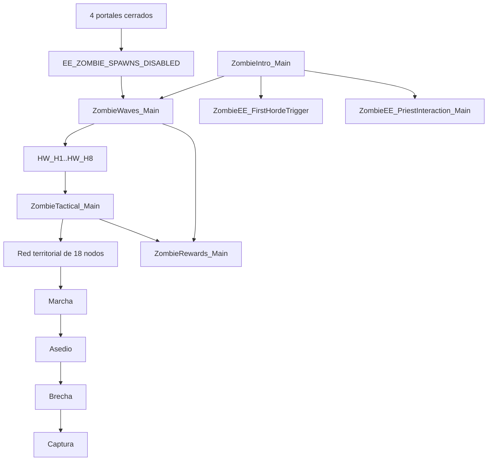
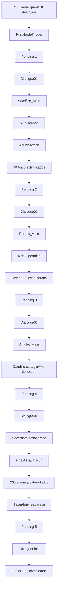

<div align="center">

# Imperivm III — Guerra Total

### Un escenario estratégico a gran escala para Imperivm III / Great Battles of Rome HD

**Guerra territorial · Fortalezas dinámicas · Recompensas estratégicas · Modo Zombies endless · Easter Egg completo**

**Versión 2.0 · 03/09/2026 · ESTABLE**

<br>


</div>

---

# Sobre el proyecto

**Imperivm III — Guerra Total** es un proyecto de modificación, scripting y diseño de escenario para **Imperivm III / Imperivm: Great Battles of Rome HD**.

El objetivo es ampliar considerablemente la profundidad estratégica del juego mediante una combinación de:

- diseño territorial;
- Sequences `.vs`;
- sistemas defensivos persistentes;
- generación dinámica de tropas;
- control táctico personalizado;
- recompensas por expansión;
- un Modo Zombies completamente integrado;
- un Easter Egg narrativo de varias fases;
- ingeniería inversa del motor y de los escenarios oficiales.

El proyecto se desarrolla sobre el mapa:

```text
Carlos Guerra Total prueba zombie
```

Estado de la compilación documentada:

```text
Versión: 2.0
Fecha: 03/09/2026
Estado: ESTABLE
```

<div align="center">
  
</div>

La intención no es sustituir las mecánicas originales de Imperivm III, sino utilizarlas como base para construir una guerra territorial más larga, dinámica y estratégica.

---

# El mapa

<div align="center">
  
</div>

El mapa está estructurado como una red de **18 ciudades principales**.

| Tipo | Cantidad |
|---|---:|
| Ciudades ocupadas al inicio | 9 |
| Ciudades neutrales | 9 |
| Total | 18 |
| Civilizaciones / jugadores principales | 8 |

Germania constituye una excepción al comenzar con dos posiciones separadas geográficamente.

## Civilizaciones

| Player | Civilización |
|---:|---|
| 1 | Roma Imperial |
| 2 | Cartago |
| 3 | Iberia |
| 4 | Galia |
| 5 | Britania |
| 6 | Germania |
| 7 | Roma Republicana |
| 8 | Egipto |

La geografía está diseñada para producir:

```text
frentes regionales
corredores de invasión
ciudades-puerta
posiciones defensivas
rutas alternativas
cuellos de botella
```

Algunas ciudades funcionan como auténticos puntos de paso territorial:

```text
N1
N3
O6
N4
O7
O9
```

El control de estas posiciones puede abrir o cerrar regiones completas del mapa.

Mapa estratégico:

[`mapa/MapaNodos.png`](mapa/MapaNodos.png)

---

# Arquitectura general de la versión 2.0

La versión estable utiliza **23 Sequences documentadas**.

```text
SISTEMAS TERRITORIALES
├── Fortresses_Main
├── ForumCaptureReward_Main
├── GGuardPost
├── GuardPostsFrontierReward_Main
└── OutpostAuxDefense_Main

MODO ZOMBIES
├── ZombieIntro_Main
├── ZombieRewards_Main
├── ZombieTactical_Main
└── ZombieWaves_Main

EASTER EGG
├── ZombieEE_FirstHordeTrigger
├── ZombieEE_PriestKeeper
├── ZombieEE_PriestInteraction_Main
├── ZombieEE_Dialogue01
├── ZombieEE_Sacrifice_Main
├── ZombieEE_AnubisAttack_Main
├── ZombieEE_Dialogue02
├── ZombieEE_Portals_Main
├── ZombieEE_Dialogue03
├── ZombieEE_Amulet_Main
├── ZombieEE_Dialogue04
├── ZombieEE_FinalAssault_Main
├── ZombieEE_FinalAssault_Run
└── ZombieEE_DialogueFinal
```

Cada Sequence tiene una responsabilidad concreta y se coordina con las demás mediante:

```text
Groups
EnvReadInt / EnvWriteInt
RunSequence
Conversation
ShowAnnouncement / HideAnnouncement
UserNotification
```

---

# Mecánicas territoriales

## 1. Fortalezas

### `Fortresses_Main`

Convierte los Outposts culturales del mapa en fortalezas defensivas persistentes.

La Sequence:

- detecta automáticamente todos los Outposts culturales;
- conserva las guarniciones neutrales originales cuando corresponde;
- aplica tratamiento especial al `EOutpost`;
- crea guarniciones específicas por cultura después de la conquista;
- mantiene las tropas vinculadas a la fortaleza;
- evita que la IA estratégica se las lleve;
- desactiva su dependencia de comida;
- las saca a combatir cuando hay enemigos;
- las devuelve al fortín cuando desaparece la amenaza;
- regenera bajas progresivamente;
- impide capturas mientras todavía existan defensores reales;
- reconstruye la guarnición tras cada cambio de propietario;
- permite ciclos de reconquista ilimitados.

Guarniciones estructurales actuales:

```text
TOutpost → 10 TValkyrie
GOutpost → 4 GTridentWarrior
BOutpost → 10 BHighlander
IOutpost → 12 ISlinger + 10 IDefender
COutpost → 24 CMacemen
ROutpost → 20 RLiberatus
EOutpost → 10 EHorusWarrior + 10 EAnubisWarrior
```

Regeneración:

```text
1 baja cada 20 segundos
sólo cuando no hay enemigos
```

Documentación:

[`docs/secuencias/01_Fortresses_Main_Explicacion_Detallada_V2.0.md`](docs/secuencias/01_Fortresses_Main_Explicacion_Detallada_V2.0.md)

---

## 2. Recompensa por ciudades neutrales

### `ForumCaptureReward_Main`

Al comenzar la partida descubre todos los `BaseTownhall` inicialmente neutrales de:

```text
Player 15
Player 16
```

Cuando uno de esos Foros es conquistado por primera vez por un Player 1-8:

```text
primera conquista
↓
100 tropas
↓
recompensa asociada a la civilización del conquistador
```

Características:

- una recompensa máxima por cada Foro inicialmente neutral;
- unidades de nivel 12;
- tropas normales;
- alimentación normal;
- control normal del jugador o IA;
- creación en el Foro conquistado;
- seguimiento persistente de qué ciudad ya entregó su recompensa.

Documentación:

[`docs/secuencias/02_ForumCaptureReward_Main_Explicacion_Detallada_V2.0.md`](docs/secuencias/02_ForumCaptureReward_Main_Explicacion_Detallada_V2.0.md)

---

## 3. Guard Posts

### `GGuardPost`

La Sequence de producción se encuentra en la sección/editor:

```text
GGuardPost
```

El comentario histórico del Source conserva el nombre antiguo:

```text
GuardPosts_Main
```

pero la documentación v2.0 utiliza el nombre real actual:

```text
GGuardPost
```

Cada `GGuardPost` conserva sus:

```text
12 sentinelas nativos
```

y la Sequence añade una escolta terrestre adicional de:

```text
10 guardianes
```

según la cultura del propietario.

Ejemplos:

```text
Roma Imperial → 5 RHastatus + 5 RPraetorian
Cartago       → 5 CNoble + 5 CBerberAssassin
Iberia        → 5 IDefender + 5 IEliteGuard
Galia         → 5 GWomanWarrior + 5 GAxeman
Britania      → 5 BBronzeSpearman + 5 BHighlander
Germania      → 5 TMaceman + 5 THuntress
```

Los guardianes:

- permanecen fuera del Settlement;
- no dependen de comida;
- quedan excluidos de la IA estratégica;
- defienden automáticamente el puesto;
- regresan a sus posiciones de guardia;
- regeneran una baja cada 30 segundos en paz;
- bloquean la captura mientras sobreviva al menos uno.

Documentación:

[`docs/secuencias/03_GGuardPost_Explicacion_Detallada_V2.0.md`](docs/secuencias/03_GGuardPost_Explicacion_Detallada_V2.0.md)

---

## 4. Recompensas estratégicas de frontera

### `GuardPostsFrontierReward_Main`

El mapa utiliza diez zonas territoriales:

```text
RewardZone_01
RewardZone_02
...
RewardZone_10
```

Cuando todos los objetos de una zona pertenecen al mismo Player 1-8:

```text
control regional completo
↓
100 tropas de recompensa
```

Cada combinación:

```text
zona + jugador
```

sólo puede cobrarse una vez.

El sistema permite que una misma región entregue recompensa a propietarios distintos si cambia de manos durante la partida.

Documentación:

[`docs/secuencias/04_GuardPostsFrontierReward_Main_Explicacion_Detallada_V2.0.md`](docs/secuencias/04_GuardPostsFrontierReward_Main_Explicacion_Detallada_V2.0.md)

---

## 5. Defensa auxiliar de Outposts

### `OutpostAuxDefense_Main`

Las tropas normales almacenadas por un jugador dentro de un Outpost pueden actuar temporalmente como defensa auxiliar.

```text
PAZ
→ la Sequence no toca las tropas normales

ATAQUE
→ las tropas almacenadas salen a combatir

JUGADOR DA UNA ORDEN MANUAL
→ la unidad se desvincula del sistema auxiliar

VUELVE A ENTRAR EN EL OUTPOST
→ puede quedar vinculada de nuevo en una defensa futura

FIN DE LA AMENAZA
→ las auxiliares regresan al Outpost
```

Las tropas auxiliares:

- son soldados reales del jugador;
- consumen comida normalmente;
- no se regeneran;
- no forman parte de la guarnición estructural;
- pueden volver al control manual del jugador.

Documentación:

[`docs/secuencias/05_OutpostAuxDefense_Main_Explicacion_Detallada_V2.0.md`](docs/secuencias/05_OutpostAuxDefense_Main_Explicacion_Detallada_V2.0.md)

---

# Modo Zombies v2.0

<div align="center">


</div>

La versión 2.0 sustituye por completo la antigua arquitectura de:

```text
40 rondas
48 hordas
HW_H1..HW_H48
ZR_PENDING
```

La arquitectura canónica actual utiliza:

```text
8 frentes persistentes
R1-R15 estructuradas
R16+ endless
scheduler no bloqueante
red táctica de 18 nodos
parada definitiva de nuevas hordas al cerrar 4 portales
```

Los cuatro módulos principales son:

```text
ZombieIntro_Main
ZombieWaves_Main
ZombieTactical_Main
ZombieRewards_Main
```

---

# Introducción Zombies

## `ZombieIntro_Main`

Es la entrada narrativa y técnica del Modo Zombies.

Flujo:

```text
vídeo introductorio
↓
cinemática en el mapa
↓
mensajero cartaginés
↓
comitiva romana
↓
conversación
↓
retirada de actores temporales
↓
César permanece en el mapa
↓
control vuelve al jugador
↓
arranque del sistema Zombies
```

La Sequence inicia después:

```text
ZombieEE_PriestKeeper
ZombieEE_PriestInteraction_Main
ZombieEE_FirstHordeTrigger
ZombieWaves_Main
```

Documentación:

[`docs/secuencias/09_ZombieIntro_Main_Explicacion_Detallada_V2.0.md`](docs/secuencias/09_ZombieIntro_Main_Explicacion_Detallada_V2.0.md)

---

# Generación de rondas

## `ZombieWaves_Main`

Configuración canónica:

| Parámetro | Valor |
|---|---:|
| Preparación inicial | 30 minutos |
| Player Zombies | 12 |
| Puntos de aparición | 8 |
| Intervalo base tras despliegue | 2 minutos |
| Pausa especial tras R5 | 10 minutos |
| Pausa especial tras R10 | 10 minutos |
| Rondas finitas | Ninguna |
| Inicio endless | R16 |
| Intervalo entre apariciones internas | 20 segundos |

Puntos:

```text
HordeSpawn_01
HordeSpawn_02
HordeSpawn_03
HordeSpawn_04
HordeSpawn_05
HordeSpawn_06
HordeSpawn_07
HordeSpawn_08
```

## Rondas 1-15

Cada ronda usa:

```text
8 apariciones
```

Cada uno de los ocho `HordeSpawn_XX` aparece:

```text
exactamente una vez
```

en orden aleatorio.

Los grupos de seguimiento son:

```text
HW_R1
HW_R2
...
HW_R15
```

## Ronda 16 y posteriores

Desde R16:

```text
16 apariciones por ronda
```

Cada spawn se utiliza:

```text
exactamente 2 veces
```

La composición base endless contiene:

```text
50 unidades por aparición
```

Por tanto una ronda endless normal despliega:

```text
16 × 50
=
800 unidades
```

Los niveles progresan:

```text
R16 → nivel 20
R17 → nivel 21
R18 → nivel 22
...
R56 → nivel 60
R57+ → nivel 60
```

Cada cinco rondas a partir de R20:

```text
+10 RHastatus
+10 TMaceman
por aparición
```

La ronda especial pasa a:

```text
70 unidades × 16
=
1120 unidades
```

## Scheduler endless

Desde R16:

```text
la siguiente ronda NO espera
a que HW_R16 quede vacío
```

Las rondas pueden solaparse.

El scheduler utiliza generaciones:

```text
ZR_ENDLESS_GENERATION
ZR_ENDLESS_DEPLOYED_GENERATION
ZR_ENDLESS_REWARDED_GENERATION
```

## Parada por portales

`ZombieWaves_Main` comprueba periódicamente:

```text
EE_ZOMBIE_SPAWNS_DISABLED
```

Cuando el Easter Egg cierra el cuarto portal:

```text
EE_ZOMBIE_SPAWNS_DISABLED = 1
↓
no se generan nuevas hordas
↓
las hordas que ya existen permanecen vivas
```

Documentación:

[`docs/secuencias/08_ZombieWaves_Main_Explicacion_Detallada_V2.0.md`](docs/secuencias/08_ZombieWaves_Main_Explicacion_Detallada_V2.0.md)

---

# IA táctica Zombies

## `ZombieTactical_Main`

La IA actual sustituye el antiguo sistema de decenas de slots independientes por:

```text
8 frentes persistentes
```

```text
HW_H1
HW_H2
HW_H3
HW_H4
HW_H5
HW_H6
HW_H7
HW_H8
```

Cada frente corresponde a uno de los ocho puntos de aparición.

## Red territorial

El controlador utiliza una red fija de:

```text
18 nodos
```

correspondiente a las ciudades del mapa.

La ruta se calcula mediante una estructura Dijkstra-like implementada con `IntArray`.

El sistema decide:

- ciudad objetivo;
- nodo ancla;
- siguiente nodo;
- ruta territorial;
- acceso a la ciudad;
- Gate relevante;
- fase de asedio;
- brecha;
- entrada;
- captura.

## Fases tácticas

```text
0 → marcha
1 → asedio
2 → avance por la brecha
3 → captura
```

## Asedio

La horda:

- detecta Gates;
- utiliza `ObjList.Siege()`;
- intenta mantener la presión;
- reagrupa unidades alejadas;
- detecta progreso a través de la brecha;
- evita abandonar la ciudad objetivo para ir a una Gate irrelevante;
- mantiene combates durante el avance.

## Captura

Cuando existe acceso al Foro:

```text
las unidades cercanas reducen loyalty
↓
al llegar al umbral
↓
Player 12 toma temporalmente la ciudad
```

El sistema puede continuar desde esa nueva posición hacia otro objetivo.

Documentación:

[`docs/secuencias/07_ZombieTactical_Main_Explicacion_Detallada_V2.0.md`](docs/secuencias/07_ZombieTactical_Main_Explicacion_Detallada_V2.0.md)

---

# Recompensas Zombies

## `ZombieRewards_Main`

La arquitectura actual separa dos sistemas.

## R1-R15

La recompensa se entrega cuando:

```text
HW_RN
queda completamente vacío
```

Cada ronda sólo puede pagarse una vez.

## R16+

Las generaciones endless no esperan a morir completamente.

La recompensa se activa cuando:

```text
el despliegue completo de la generación
ha sido confirmado
```

mediante:

```text
ZR_ENDLESS_DEPLOYED_GENERATION
```

y queda protegida contra duplicados mediante:

```text
ZR_ENDLESS_REWARDED_GENERATION
```

## Destinatarios

El sistema utiliza la máscara de propietarios publicada por Tactical.

Si ningún frente ha publicado propietario válido, existe un fallback sobre Players 1-8 que todavía posean un `BaseTownhall`.

## Recompensa endless

Desde R16:

```text
28 tropas
```

por jugador recompensado.

Nivel:

```text
20 + (ronda - 16)
máximo 60
```

Documentación:

[`docs/secuencias/06_ZombieRewards_Main_Explicacion_Detallada_V2.0.md`](docs/secuencias/06_ZombieRewards_Main_Explicacion_Detallada_V2.0.md)

---

# Arquitectura actual del Modo Zombies



---

# Easter Egg — El Eclipse de Anubis

La versión 2.0 incorpora un Easter Egg completo integrado dentro del Modo Zombies.

No es una mecánica separada del mapa.

Utiliza:

```text
César
sacerdote egipcio
sacrificio de aldeanos
Guerreros de Anubis
ocho portales
Gem of Power
campamento cartaginés
asalto final
diálogo final
recompensas especiales
```

El flujo general es:

```text
primera mini-horda de HordeSpawn_01 destruida
↓
Dialogue01
↓
50 aldeanos sacrificados
↓
50 Guerreros de Anubis
↓
Dialogue02
↓
cerrar 4 de 8 portales
↓
se detienen nuevas hordas Zombies
↓
Dialogue03
↓
campamento cartaginés / Gem of Power
↓
Dialogue04
↓
sacerdote desaparece
↓
asalto final de 200 enemigos
↓
sacerdote reaparece
↓
DialogueFinal
↓
recompensa final
```

---

# Primera activación

## `ZombieEE_FirstHordeTrigger`

Durante R1, las unidades creadas específicamente desde:

```text
HordeSpawn_01
```

también se registran en:

```text
EE_FirstHorde_Spawn01
```

Cuando esa mini-horda ha terminado de generarse y todos sus miembros han muerto:

```text
EE_PRIEST_PENDING = 1
```

César debe regresar físicamente al sacerdote.

Documentación:

[`docs/secuencias/10_ZombieEE_FirstHordeTrigger_Explicacion_Detallada_V2.0.md`](docs/secuencias/10_ZombieEE_FirstHordeTrigger_Explicacion_Detallada_V2.0.md)

---

# Sacerdote persistente

## `ZombieEE_PriestKeeper`

Mantiene al sacerdote:

```text
SetNoAIFlag(true)
SetFeeding(false)
SetHealth(1000)
```

y lo devuelve a su posición de origen si se aleja.

Durante el asalto final:

```text
EE_PRIEST_HIDDEN = 1
```

permite que el sacerdote desaparezca temporalmente sin que PriestKeeper intente recuperarlo.

Cuando reaparece:

```text
EE_PRIEST_HIDDEN = 0
```

y vuelve a ser protegido.

Documentación:

[`docs/secuencias/11_ZombieEE_PriestKeeper_Explicacion_Detallada_V2.0.md`](docs/secuencias/11_ZombieEE_PriestKeeper_Explicacion_Detallada_V2.0.md)

---

# Interacción presencial

## `ZombieEE_PriestInteraction_Main`

Toda la narrativa utiliza una única variable:

```text
EE_PRIEST_PENDING
```

Mapa actual:

```text
1 → ZombieEE_Dialogue01
2 → ZombieEE_Dialogue02
3 → ZombieEE_Dialogue03
4 → ZombieEE_Dialogue04
5 → ZombieEE_DialogueFinal
```

Cuando existe un diálogo pendiente:

```text
VE A HABLAR CON EL SACERDOTE EGIPCIO
```

se recuerda aproximadamente cada 15 segundos.

El diálogo sólo comienza cuando:

```text
César <= 180
```

del sacerdote.

Documentación:

[`docs/secuencias/12_ZombieEE_PriestInteraction_Main_Explicacion_Detallada_V2.0.md`](docs/secuencias/12_ZombieEE_PriestInteraction_Main_Explicacion_Detallada_V2.0.md)

---

# Dialogue01 — Las cincuenta almas

## `ZombieEE_Dialogue01`

Después de la primera visita al sacerdote:

```text
EE_SACRIFICE_ENABLED = 1
↓
RunSequence("ZombieEE_Sacrifice_Main")
```

Objetivo:

```text
CONDUCE 50 ALDEANOS HASTA LAS PIRAMIDES
```

Documentación:

[`docs/secuencias/13_ZombieEE_Dialogue01_Explicacion_Detallada_V2.0.md`](docs/secuencias/13_ZombieEE_Dialogue01_Explicacion_Detallada_V2.0.md)

---

# Sacrificio

## `ZombieEE_Sacrifice_Main`

La Sequence detecta aldeanos válidos alrededor de:

```text
ZombieEE_SacrificePyramids
```

y cuenta las almas entregadas.

Objetivo:

```text
50 aldeanos
```

Al completar el sacrificio:

```text
EE_SACRIFICE_COMPLETED = 1
↓
RunSequence("ZombieEE_AnubisAttack_Main")
```

Documentación:

[`docs/secuencias/14_ZombieEE_Sacrifice_Main_Explicacion_Detallada_V2.0.md`](docs/secuencias/14_ZombieEE_Sacrifice_Main_Explicacion_Detallada_V2.0.md)

---

# Ataque de Anubis

## `ZombieEE_AnubisAttack_Main`

Después del sacrificio aparecen:

```text
50 EAnubisWarrior
nivel 40
Player 12
```

desde:

```text
HordeSpawn_01
```

Todos pertenecen al Group:

```text
EE_AnubisWave01
```

y avanzan hacia:

```text
CapitalForum_P1
```

Cuando todos mueren:

```text
EE_ANUBIS_ATTACK_COMPLETED = 1
EE_PRIEST_PENDING = 2
```

Documentación:

[`docs/secuencias/15_ZombieEE_AnubisAttack_Main_Explicacion_Detallada_V2.0.md`](docs/secuencias/15_ZombieEE_AnubisAttack_Main_Explicacion_Detallada_V2.0.md)

---

# Dialogue02 — Los portales

## `ZombieEE_Dialogue02`

La segunda conversación activa:

```text
EE_PORTALS_ENABLED = 1
```

e inicia:

```text
ZombieEE_Portals_Main
```

Objetivo:

```text
CIERRA 4 PORTALES CUALESQUIERA
CON SACERDOTES ROMANOS
```

Documentación:

[`docs/secuencias/16_ZombieEE_Dialogue02_Explicacion_Detallada_V2.0.md`](docs/secuencias/16_ZombieEE_Dialogue02_Explicacion_Detallada_V2.0.md)

---

# Los ocho portales

## `ZombieEE_Portals_Main`

Los propios:

```text
HordeSpawn_01..08
```

funcionan también como posiciones de portal.

Un portal abierto se activa cuando un:

```text
RPriest de Player 1
```

entra a:

```text
<=220
```

del punto.

Cada portal genera:

```text
10 EAnubisWarrior
10 EHorusWarrior
nivel 20
Player 12
```

Cuando mueren los 20 guardianes:

```text
el portal queda cerrado
```

y Player 1 recibe dentro de `CapitalForum_P1`:

```text
20 RPraetorian
15 RHastatus
15 RArcher
nivel 25
```

Sólo es necesario cerrar:

```text
4 de los 8 portales
```

en cualquier orden.

Al registrar el cuarto cierre:

```text
EE_ZOMBIE_SPAWNS_DISABLED = 1
```

Las nuevas hordas Zombies dejan de aparecer.

Después:

```text
EE_PRIEST_PENDING = 3
```

Documentación:

[`docs/secuencias/17_ZombieEE_Portals_Main_Explicacion_Detallada_V2.0.md`](docs/secuencias/17_ZombieEE_Portals_Main_Explicacion_Detallada_V2.0.md)

---

# Dialogue03 — Gem of Power

## `ZombieEE_Dialogue03`

Después de cerrar los cuatro portales necesarios:

```text
EE_PORTAL_PHASE_FINISHED = 1
EE_AMULET_HUNT_ENABLED = 1
↓
RunSequence("ZombieEE_Amulet_Main")
```

Objetivo:

```text
ATACA EL CAMPAMENTO DEL SUR
Y RECUPERA GEM OF POWER
```

Documentación:

[`docs/secuencias/18_ZombieEE_Dialogue03_Explicacion_Detallada_V2.0.md`](docs/secuencias/18_ZombieEE_Dialogue03_Explicacion_Detallada_V2.0.md)

---

# Campamento cartaginés

## `ZombieEE_Amulet_Main`

La implementación v2.0 simplifica la antigua idea de transportar físicamente un objeto de inventario.

La mecánica actual es:

```text
aparece un campamento cartaginés
↓
aparece un caudillo CHero1 con su ejército
↓
el jugador debe matar al caudillo
↓
la fase queda completada
↓
EE_PRIEST_PENDING = 4
```

No existe una Gem of Power física que el jugador tenga que transportar manualmente.

La Gem of Power funciona como elemento narrativo asociado a la derrota del caudillo.

Documentación:

[`docs/secuencias/19_ZombieEE_Amulet_Main_Explicacion_Detallada_V2.0.md`](docs/secuencias/19_ZombieEE_Amulet_Main_Explicacion_Detallada_V2.0.md)

---

# Dialogue04 — El sacerdote parte hacia Egipto

## `ZombieEE_Dialogue04`

Después de completar la fase del caudillo:

```text
ZombieEE_Conv04
↓
guardar posición y propietario del sacerdote
↓
EE_PRIEST_HIDDEN = 1
↓
RemoveFromGroup("ZombieEE_Priest01")
↓
Erase()
↓
el sacerdote desaparece
```

Después prepara:

```text
EE_FINAL_ASSAULT_ENABLED = 1
EE_FINAL_ASSAULT_STARTED = 0
EE_FINAL_ASSAULT_COMPLETED = 0
EE_FINAL_BATCH_DEPLOYED = 0
```

y lanza expresamente:

```text
ZombieEE_FinalAssault_Run
```

Documentación:

[`docs/secuencias/20_ZombieEE_Dialogue04_Explicacion_Detallada_V2.0.md`](docs/secuencias/20_ZombieEE_Dialogue04_Explicacion_Detallada_V2.0.md)

---

# Asalto final histórico

## `ZombieEE_FinalAssault_Main`

La compilación v2.0 conserva esta Sequence porque contiene la implementación histórica completa del asalto final.

Sin embargo:

```text
NO es el punto de entrada utilizado actualmente
```

`ZombieEE_Dialogue04` lanza:

```text
ZombieEE_FinalAssault_Run
```

La documentación de `FinalAssault_Main` se conserva como referencia técnica e histórica.

Documentación:

[`docs/secuencias/21_ZombieEE_FinalAssault_Main_Explicacion_Detallada_V2.0.md`](docs/secuencias/21_ZombieEE_FinalAssault_Main_Explicacion_Detallada_V2.0.md)

---

# Asalto final activo

## `ZombieEE_FinalAssault_Run`

Es el asalto final realmente utilizado en v2.0.

Configuración:

```text
8 tandas
×
25 enemigos
=
200 atacantes
```

Niveles:

```text
Tanda 1 → 20
Tanda 2 → 26
Tanda 3 → 32
Tanda 4 → 38
Tanda 5 → 44
Tanda 6 → 50
Tanda 7 → 55
Tanda 8 → 60
```

Intervalo:

```text
20 segundos entre tandas
```

Todos los enemigos:

```text
Player 12
Group EE_FinalAssault
SetFeeding(false)
SetNoAIFlag(true)
advance → CapitalForum_P1
```

El sistema no utiliza:

```text
HW_H1..8
ZombieTactical_Main
orden capture
```

Cuando mueren todos:

```text
recrear EPriest
↓
AddToGroup("ZombieEE_Priest01")
↓
EE_PRIEST_HIDDEN = 0
↓
EE_FINAL_ASSAULT_COMPLETED = 1
↓
EE_FINAL_ASSAULT_ENABLED = 0
↓
EE_PRIEST_PENDING = 5
```

Documentación:

[`docs/secuencias/22_ZombieEE_FinalAssault_Run_Explicacion_Detallada_V2.0.md`](docs/secuencias/22_ZombieEE_FinalAssault_Run_Explicacion_Detallada_V2.0.md)

---

# Diálogo final

## `ZombieEE_DialogueFinal`

Después de la última visita al sacerdote:

```text
ZombieEE_ConvFinal
```

cierra narrativamente el Easter Egg.

La Sequence:

- revela la conspiración de Egipto y Cartago;
- procesa al sacerdote;
- entrega las recompensas finales;
- marca el Easter Egg como terminado;
- deja cerrada la cadena narrativa.

Documentación:

[`docs/secuencias/23_ZombieEE_DialogueFinal_Explicacion_Detallada_V2.0.md`](docs/secuencias/23_ZombieEE_DialogueFinal_Explicacion_Detallada_V2.0.md)

---

# Arquitectura completa del Easter Egg



---

# Documentación de Sequences

La documentación v2.0 queda organizada así:

| Nº | Sequence | Documento |
|---:|---|---|
| 01 | `Fortresses_Main` | [`01_Fortresses_Main_Explicacion_Detallada_V2.0.md`](docs/secuencias/01_Fortresses_Main_Explicacion_Detallada_V2.0.md) |
| 02 | `ForumCaptureReward_Main` | [`02_ForumCaptureReward_Main_Explicacion_Detallada_V2.0.md`](docs/secuencias/02_ForumCaptureReward_Main_Explicacion_Detallada_V2.0.md) |
| 03 | `GGuardPost` | [`03_GGuardPost_Explicacion_Detallada_V2.0.md`](docs/secuencias/03_GGuardPost_Explicacion_Detallada_V2.0.md) |
| 04 | `GuardPostsFrontierReward_Main` | [`04_GuardPostsFrontierReward_Main_Explicacion_Detallada_V2.0.md`](docs/secuencias/04_GuardPostsFrontierReward_Main_Explicacion_Detallada_V2.0.md) |
| 05 | `OutpostAuxDefense_Main` | [`05_OutpostAuxDefense_Main_Explicacion_Detallada_V2.0.md`](docs/secuencias/05_OutpostAuxDefense_Main_Explicacion_Detallada_V2.0.md) |
| 06 | `ZombieRewards_Main` | [`06_ZombieRewards_Main_Explicacion_Detallada_V2.0.md`](docs/secuencias/06_ZombieRewards_Main_Explicacion_Detallada_V2.0.md) |
| 07 | `ZombieTactical_Main` | [`07_ZombieTactical_Main_Explicacion_Detallada_V2.0.md`](docs/secuencias/07_ZombieTactical_Main_Explicacion_Detallada_V2.0.md) |
| 08 | `ZombieWaves_Main` | [`08_ZombieWaves_Main_Explicacion_Detallada_V2.0.md`](docs/secuencias/08_ZombieWaves_Main_Explicacion_Detallada_V2.0.md) |
| 09 | `ZombieIntro_Main` | [`09_ZombieIntro_Main_Explicacion_Detallada_V2.0.md`](docs/secuencias/09_ZombieIntro_Main_Explicacion_Detallada_V2.0.md) |
| 10 | `ZombieEE_FirstHordeTrigger` | [`10_ZombieEE_FirstHordeTrigger_Explicacion_Detallada_V2.0.md`](docs/secuencias/10_ZombieEE_FirstHordeTrigger_Explicacion_Detallada_V2.0.md) |
| 11 | `ZombieEE_PriestKeeper` | [`11_ZombieEE_PriestKeeper_Explicacion_Detallada_V2.0.md`](docs/secuencias/11_ZombieEE_PriestKeeper_Explicacion_Detallada_V2.0.md) |
| 12 | `ZombieEE_PriestInteraction_Main` | [`12_ZombieEE_PriestInteraction_Main_Explicacion_Detallada_V2.0.md`](docs/secuencias/12_ZombieEE_PriestInteraction_Main_Explicacion_Detallada_V2.0.md) |
| 13 | `ZombieEE_Dialogue01` | [`13_ZombieEE_Dialogue01_Explicacion_Detallada_V2.0.md`](docs/secuencias/13_ZombieEE_Dialogue01_Explicacion_Detallada_V2.0.md) |
| 14 | `ZombieEE_Sacrifice_Main` | [`14_ZombieEE_Sacrifice_Main_Explicacion_Detallada_V2.0.md`](docs/secuencias/14_ZombieEE_Sacrifice_Main_Explicacion_Detallada_V2.0.md) |
| 15 | `ZombieEE_AnubisAttack_Main` | [`15_ZombieEE_AnubisAttack_Main_Explicacion_Detallada_V2.0.md`](docs/secuencias/15_ZombieEE_AnubisAttack_Main_Explicacion_Detallada_V2.0.md) |
| 16 | `ZombieEE_Dialogue02` | [`16_ZombieEE_Dialogue02_Explicacion_Detallada_V2.0.md`](docs/secuencias/16_ZombieEE_Dialogue02_Explicacion_Detallada_V2.0.md) |
| 17 | `ZombieEE_Portals_Main` | [`17_ZombieEE_Portals_Main_Explicacion_Detallada_V2.0.md`](docs/secuencias/17_ZombieEE_Portals_Main_Explicacion_Detallada_V2.0.md) |
| 18 | `ZombieEE_Dialogue03` | [`18_ZombieEE_Dialogue03_Explicacion_Detallada_V2.0.md`](docs/secuencias/18_ZombieEE_Dialogue03_Explicacion_Detallada_V2.0.md) |
| 19 | `ZombieEE_Amulet_Main` | [`19_ZombieEE_Amulet_Main_Explicacion_Detallada_V2.0.md`](docs/secuencias/19_ZombieEE_Amulet_Main_Explicacion_Detallada_V2.0.md) |
| 20 | `ZombieEE_Dialogue04` | [`20_ZombieEE_Dialogue04_Explicacion_Detallada_V2.0.md`](docs/secuencias/20_ZombieEE_Dialogue04_Explicacion_Detallada_V2.0.md) |
| 21 | `ZombieEE_FinalAssault_Main` | [`21_ZombieEE_FinalAssault_Main_Explicacion_Detallada_V2.0.md`](docs/secuencias/21_ZombieEE_FinalAssault_Main_Explicacion_Detallada_V2.0.md) |
| 22 | `ZombieEE_FinalAssault_Run` | [`22_ZombieEE_FinalAssault_Run_Explicacion_Detallada_V2.0.md`](docs/secuencias/22_ZombieEE_FinalAssault_Run_Explicacion_Detallada_V2.0.md) |
| 23 | `ZombieEE_DialogueFinal` | [`23_ZombieEE_DialogueFinal_Explicacion_Detallada_V2.0.md`](docs/secuencias/23_ZombieEE_DialogueFinal_Explicacion_Detallada_V2.0.md) |

---

# Manual técnico

El manual central actualizado del proyecto es:

[`docs/manual/Imperivm_III_Manual_Ingenieria_Inversa_V2.0_Actualizado.md`](docs/manual/Imperivm_III_Manual_Ingenieria_Inversa_V2.0_Actualizado.md)

Documenta, entre otros temas:

- CKS/VS y Sequences;
- `Obj`, `Unit`, `Building` y `Settlement`;
- Queries y `ObjList`;
- `Place()`;
- Groups estáticos y dinámicos;
- `EnvReadInt()` / `EnvWriteInt()`;
- `IntArray`;
- `SetNoAIFlag()`;
- `SetFeeding()`;
- captura y loyalty;
- Townhalls;
- Outposts;
- `GGuardPost`;
- Gates;
- `ObjList.Siege()`;
- catapultas y `RamUnit`;
- AI Helpers;
- `RunSequence()`;
- `Conversation`;
- cinematográficas;
- `PlayMovie()`;
- control de cámara;
- anuncios;
- `UserNotification`;
- `Unit.AddItem`;
- estado compartido;
- máquinas de estados;
- arquitectura técnica del Modo Zombies v2.0;
- arquitectura del Easter Egg.

---

# Groups manuales principales

## Estado global / capital

```text
CapitalForum_P1
```

Es además el objeto de estado compartido principal del Modo Zombies y del Easter Egg.

Las recompensas territoriales utilizan también:

```text
CapitalForum_P1
CapitalForum_P2
CapitalForum_P3
CapitalForum_P4
CapitalForum_P5
CapitalForum_P6
CapitalForum_P7
CapitalForum_P8
```

según la mecánica.

---

## Reward Zones

```text
RewardZone_01
RewardZone_02
RewardZone_03
RewardZone_04
RewardZone_05
RewardZone_06
RewardZone_07
RewardZone_08
RewardZone_09
RewardZone_10
```

---

## Spawns Zombies / Portales

```text
HordeSpawn_01
HordeSpawn_02
HordeSpawn_03
HordeSpawn_04
HordeSpawn_05
HordeSpawn_06
HordeSpawn_07
HordeSpawn_08
```

Los ocho puntos cumplen doble función:

```text
spawns de Zombies
+
portales del Easter Egg
```

---

## Personajes del Easter Egg

```text
ZombieEE_Caesar
ZombieEE_Priest01
```

---

## Zona de sacrificio

```text
ZombieEE_SacrificePyramids
```

---

# Groups dinámicos importantes

Estos Groups son gestionados por las Sequences y no deben poblarse manualmente como ejércitos iniciales.

## Fortalezas

```text
__FRT_X_Y
__FRT_AUX_X_Y
```

---

## Guard Posts

```text
__GP_X_Y
```

---

## Frentes Zombies

```text
HW_H1
HW_H2
HW_H3
HW_H4
HW_H5
HW_H6
HW_H7
HW_H8
```

---

## Rondas Zombies

```text
HW_R1
...
HW_R15
HW_R16
```

`HW_R16` actúa como Group compartido para las rondas endless, pero no se utiliza para bloquear el scheduler.

---

## Easter Egg

```text
EE_FirstHorde_Spawn01
EE_AnubisWave01
EE_PortalGuardiansActive
EE_PortalRewards
ZombieEE_AmuletArmy
ZombieEE_AmuletCarrier
EE_FinalAssault
ZombieEE_FinalRewards
ZombieEE_Prisoner
```

---

# Autorun y orquestación

No todas las Sequences deben configurarse con Autorun.

## Autorun principal

Los sistemas persistentes de producción incluyen:

```text
Fortresses_Main
ForumCaptureReward_Main
GGuardPost
GuardPostsFrontierReward_Main
OutpostAuxDefense_Main
ZombieIntro_Main
ZombieRewards_Main
ZombieTactical_Main
```

## Lanzamiento diferido

El resto del flujo Zombies / Easter Egg se orquesta mediante:

```text
RunSequence()
```

Especialmente:

```text
ZombieWaves_Main
ZombieEE_FirstHordeTrigger
ZombieEE_PriestKeeper
ZombieEE_PriestInteraction_Main
ZombieEE_Dialogue01
ZombieEE_Sacrifice_Main
ZombieEE_AnubisAttack_Main
ZombieEE_Dialogue02
ZombieEE_Portals_Main
ZombieEE_Dialogue03
ZombieEE_Amulet_Main
ZombieEE_Dialogue04
ZombieEE_FinalAssault_Run
ZombieEE_DialogueFinal
```

`ZombieEE_FinalAssault_Main` se conserva como implementación histórica, pero no es el punto de entrada utilizado por Dialogue04.

---

# Estructura recomendada del repositorio

```text
Imperivm-III-Guerra-Total/
│
├── README.md
├── .gitignore
│
├── docs/
│   ├── manual/
│   │   └── Imperivm_III_Manual_Ingenieria_Inversa_V2.0_Actualizado.md
│   │
│   └── secuencias/
│       ├── 01_Fortresses_Main_Explicacion_Detallada_V2.0.md
│       ├── 02_ForumCaptureReward_Main_Explicacion_Detallada_V2.0.md
│       ├── 03_GGuardPost_Explicacion_Detallada_V2.0.md
│       ├── 04_GuardPostsFrontierReward_Main_Explicacion_Detallada_V2.0.md
│       ├── 05_OutpostAuxDefense_Main_Explicacion_Detallada_V2.0.md
│       ├── 06_ZombieRewards_Main_Explicacion_Detallada_V2.0.md
│       ├── 07_ZombieTactical_Main_Explicacion_Detallada_V2.0.md
│       ├── 08_ZombieWaves_Main_Explicacion_Detallada_V2.0.md
│       ├── 09_ZombieIntro_Main_Explicacion_Detallada_V2.0.md
│       ├── 10_ZombieEE_FirstHordeTrigger_Explicacion_Detallada_V2.0.md
│       ├── 11_ZombieEE_PriestKeeper_Explicacion_Detallada_V2.0.md
│       ├── 12_ZombieEE_PriestInteraction_Main_Explicacion_Detallada_V2.0.md
│       ├── 13_ZombieEE_Dialogue01_Explicacion_Detallada_V2.0.md
│       ├── 14_ZombieEE_Sacrifice_Main_Explicacion_Detallada_V2.0.md
│       ├── 15_ZombieEE_AnubisAttack_Main_Explicacion_Detallada_V2.0.md
│       ├── 16_ZombieEE_Dialogue02_Explicacion_Detallada_V2.0.md
│       ├── 17_ZombieEE_Portals_Main_Explicacion_Detallada_V2.0.md
│       ├── 18_ZombieEE_Dialogue03_Explicacion_Detallada_V2.0.md
│       ├── 19_ZombieEE_Amulet_Main_Explicacion_Detallada_V2.0.md
│       ├── 20_ZombieEE_Dialogue04_Explicacion_Detallada_V2.0.md
│       ├── 21_ZombieEE_FinalAssault_Main_Explicacion_Detallada_V2.0.md
│       ├── 22_ZombieEE_FinalAssault_Run_Explicacion_Detallada_V2.0.md
│       └── 23_ZombieEE_DialogueFinal_Explicacion_Detallada_V2.0.md
│
├── mapa/
│   ├── MapaNodos.png
│   ├── Mapa desde Editor.jpg
│   └── Mapa.jpg
│
└── secuencias/
    ├── Fortresses_Main.vs
    ├── ForumCaptureReward_Main.vs
    ├── GGuardPost.vs
    ├── GuardPostsFrontierReward_Main.vs
    ├── OutpostAuxDefense_Main.vs
    └── Modo zombie/
        ├── modo zombies.png
        ├── ZombieIntro_Main.vs
        ├── ZombieRewards_Main.vs
        ├── ZombieTactical_Main.vs
        ├── ZombieWaves_Main.vs
        └── ZombieEE_*.vs
```

---

# Estado actual del proyecto

| Sistema | Estado v2.0 |
|---|---|
| Mapa estratégico | Implementado |
| Sistema de fortalezas | Estable |
| Recompensa por Foro neutral | Estable |
| Guard Posts | Estable |
| Recompensas territoriales | Estables |
| Defensa auxiliar de Outposts | Estable |
| Intro Zombies | Implementada |
| Generación Zombies R1-R15 | Estable |
| Zombies R16+ endless | Implementado |
| 8 frentes tácticos | Implementados |
| Red territorial de 18 nodos | Implementada |
| Asedio Zombies | Implementado |
| Captura Zombies | Implementada |
| Recompensas Zombies | Implementadas |
| Easter Egg | Completo |
| Sacrificio de 50 aldeanos | Implementado |
| Ataque de 50 Anubis | Implementado |
| 8 portales / cierre de 4 | Implementado |
| Parada definitiva de nuevas hordas | Implementada |
| Campamento cartaginés | Implementado |
| Asalto final de 200 unidades | Implementado |
| Diálogo y recompensa final | Implementados |
| Manual técnico | Actualizado a v2.0 |
| Documentación de Sequences | 23/23 |

---

# Limitaciones conocidas

## IA de asedio y unidades `InHolder`

El sistema Tactical puede mantener tripulaciones asociadas a un asedio.

Existe una limitación conocida:

```text
una unidad puede permanecer InHolder
después de que una Gate haya alcanzado el umbral de rotura
```

Se evitaron intentos agresivos de expulsión forzada porque podían producir inestabilidad.

La arquitectura endless ya no depende de que esos residuos desaparezcan para lanzar la siguiente ronda.

---

## Asalto final

El asalto final del Easter Egg:

```text
NO utiliza ZombieTactical_Main
```

Los 200 atacantes reciben:

```text
advance → CapitalForum_P1
```

y sólo se reactiva una unidad cuando queda:

```text
idle
```

Esto preserva los combates, pero no reproduce toda la máquina táctica avanzada de Gates, brechas y captura del modo Zombies normal.

---

## Navegación marítima

El motor dispone de:

```text
agua
barcos
puertos
navegación
```

pero la IA estratégica aprovecha estas rutas de forma limitada comparada con el movimiento terrestre.

Por ello el diseño principal del mapa se apoya en corredores terrestres.

---

## Player técnico 12

El Modo Zombies utiliza:

```text
Player 12
```

como facción técnica.

Su comportamiento está integrado en el escenario actual, pero cualquier modificación profunda de condiciones de victoria, diplomacia o reglas globales debe comprobarse teniendo en cuenta la existencia de este Player.

---

# Filosofía de desarrollo

Imperivm III no debe tratarse como C++ estándar.

El proyecto utiliza esta jerarquía de evidencia:

```text
prueba real en partida
        ↓
Sequence estable del proyecto
        ↓
Sequence oficial
        ↓
script nativo
        ↓
definición interna de clase
        ↓
análisis automatizado
        ↓
inferencia
```

No se incorporan APIs al código de producción únicamente porque su nombre parezca plausible.

La investigación ha confirmado, entre otras, herramientas como:

```text
Place()
SetPlayer()
SetHealth()
SetLevel()
SetFood()
SetFeeding()
SetNoAIFlag()
ForceAddUnit()
ObjsInRange()
EnemyObjs()
ClassPlayerObjs()
Group()
AddToGroup()
RemoveFromGroup()
EnvReadInt()
EnvWriteInt()
IntArray
ObjList.Siege()
SetCommand()
RunSequence()
RunAIHelper()
Conversation.Init()
Conversation.SetActor()
Conversation.Run()
PlayMovie()
BlockUserInput()
UnblockUserInput()
StartViewFollow()
StopViewFollow()
ShowAnnouncement()
HideAnnouncement()
UserNotification()
Unit.AddItem()
```

---

# Objetivo del proyecto

La intención de **Imperivm III — Guerra Total** es convertir una partida normal en una guerra territorial de larga duración donde:

- la geografía importe;
- conquistar una posición tenga consecuencias;
- las fortalezas sean objetivos militares reales;
- los puestos fronterizos tengan valor;
- las ciudades neutrales impulsen la expansión;
- las tropas almacenadas participen en la defensa;
- las regiones produzcan frentes distintos;
- la IA tenga nuevos sistemas con los que interactuar;
- el Modo Zombies altere el equilibrio entre civilizaciones;
- las rondas puedan continuar indefinidamente;
- el jugador pueda descubrir un Easter Egg completo durante la partida.

El proyecto combina:

```text
diseño de mapa
+
scripting
+
experimentación
+
ingeniería inversa
+
documentación técnica
```

para llevar el editor de Imperivm III mucho más allá de sus mecánicas habituales.

---

# Aviso

Este es un proyecto **no oficial** realizado para **Imperivm III / Imperivm: Great Battles of Rome HD**.

No está afiliado ni respaldado por los desarrolladores o distribuidores originales del juego.

Todo el trabajo de scripting, documentación, diseño de escenario e investigación contenido en este repositorio corresponde al proyecto **Imperivm III — Guerra Total**.

