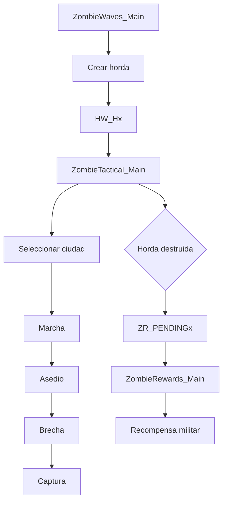
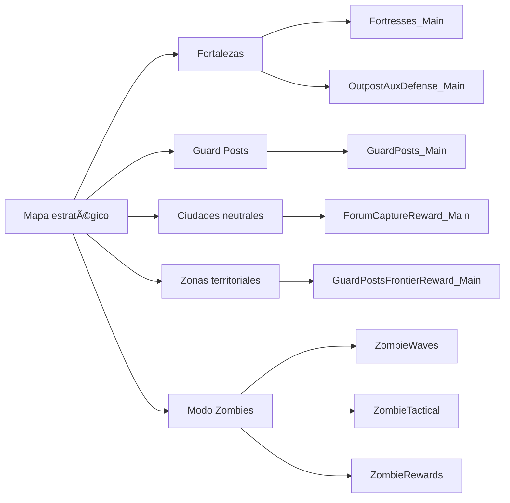

<div align="center">

# Imperivm III — Guerra Total

### Un escenario estratégico a gran escala para Imperivm III / Great Battles of Rome HD

**Guerra territorial · Fortalezas dinámicas · Defensa automatizada · Recompensas estratégicas · Modo Zombies**

<br>


</div>

---

## Sobre el proyecto

**Imperivm III — Guerra Total** es un proyecto de modificación y diseño de escenario para **Imperivm III / Imperivm: Great Battles of Rome HD** orientado a ampliar considerablemente la profundidad estratégica del juego.

El proyecto parte de un mapa diseñado para enfrentar a las ocho civilizaciones jugables dentro de una red territorial de ciudades, fortalezas, puestos defensivos y corredores naturales.

<div align="center">
  
</div>

Sobre esa base se han desarrollado sistemas propios mediante **Sequences `.vs`**, aprovechando y ampliando comportamientos existentes del motor:

* fortalezas con guarniciones persistentes;
* defensa automática de posiciones estratégicas;
* reconquista dinámica;
* recompensas por expansión;
* zonas territoriales que premian el dominio regional;
* utilización defensiva de tropas almacenadas;
* un modo Zombies completo basado en oleadas, asedios y conquista de ciudades;
* documentación técnica del lenguaje de scripting de Imperivm III;
* investigación del comportamiento interno del motor mediante ingeniería inversa.

El objetivo no es sustituir las mecánicas originales, sino utilizarlas como base para construir una partida más territorial, dinámica y prolongada.

---

# El mapa

<div align="center">
  
</div>


El mapa está estructurado como una red de **18 ciudades principales**:

| Tipo                                   | Cantidad |
| -------------------------------------- | -------: |
| Ciudades ocupadas al inicio            |        9 |
| Ciudades neutrales                     |        9 |
| Total                                  |       18 |
| Civilizaciones / jugadores principales |        8 |

Germania constituye una excepción al comenzar con dos posiciones separadas geográficamente.

## Civilizaciones

| Player | Civilización     |
| -----: | ---------------- |
|      1 | Roma Imperial    |
|      2 | Cartago          |
|      3 | Iberia           |
|      4 | Galia            |
|      5 | Britania         |
|      6 | Germania         |
|      7 | Roma Republicana |
|      8 | Egipto           |

El mapa no funciona como una arena completamente abierta.

Montañas, bosques, ríos, ciudades y corredores naturales dividen el territorio en regiones y generan puntos de paso estratégicos.

Algunas ciudades funcionan como auténticas **puertas territoriales**:

```text
N1
N3
O6
N4
O7
O9
```

Controlarlas puede abrir o cerrar el acceso entre regiones enteras.

La intención es que la geografía produzca frentes reconocibles, guerras regionales y expansiones diferentes en cada partida.

Mapa estratégico de nodos:

[`mapa/Mapa Nodos.png`](mapa/MapaNodos.png)

---

# Mecánicas principales

El escenario utiliza varias Sequences independientes.

Cada una resuelve una responsabilidad concreta y puede interactuar con las demás sin convertir el proyecto en una única Sequence monolítica.

## Sistema de fortalezas

### `Fortresses_Main`

Convierte los Outposts culturales del mapa en **fortalezas defensivas persistentes**.

Gestiona automáticamente:

* descubrimiento de fortalezas;
* guarniciones específicas según cultura;
* defensa automática;
* salida y retorno de los defensores;
* regeneración gradual de bajas;
* bloqueo de la captura mientras la posición siga defendida;
* cambio de propietario;
* reconstrucción de la guarnición tras una conquista;
* reconquistas ilimitadas.

Las guarniciones pertenecen estructuralmente a la fortaleza.

No funcionan como un ejército gratuito para el jugador y no dependen de la alimentación normal.

Una única Sequence administra todos los Outposts culturales del escenario.

Documentación:

[`docs/secuencias/01_Fortresses_Main_Explicacion_Detallada.md`](docs/secuencias/01_Fortresses_Main_Explicacion_Detallada.md)

---

## Recompensa por conquista de ciudades neutrales

### `ForumCaptureReward_Main`

Las ciudades neutrales no son únicamente posiciones territoriales.

Cuando un jugador conquista por primera vez uno de los Foros neutrales definidos por el escenario, recibe una **recompensa militar asociada a su civilización**.

El sistema:

* descubre los Townhalls neutrales al comenzar la partida;
* conserva su referencia aunque cambien de propietario;
* detecta su primera conquista;
* identifica al jugador conquistador;
* genera dos bloques de 50 unidades;
* entrega un total de 100 tropas;
* marca permanentemente esa ciudad como recompensada.

A diferencia de las guarniciones de fortalezas, estas unidades son **tropas normales**:

* consumen comida;
* pueden recibir órdenes;
* pueden ser utilizadas por la IA;
* no se regeneran;
* no quedan controladas posteriormente por la Sequence.

Documentación:

[`docs/secuencias/02_ForumCaptureReward_Main_Explicacion_Detallada.md`](docs/secuencias/02_ForumCaptureReward_Main_Explicacion_Detallada.md)

---

## Guard Posts

### `GuardPosts_Main`

Los `GGuardPost` utilizan un sistema distinto al de las fortalezas convencionales.

Su defensa nativa se conserva y la Sequence añade una segunda capa terrestre.

Cada Guard Post combina:

```text
defensa nativa de sentinelas
+
10 guardianes terrestres
```

Los guardianes:

* dependen de la civilización del propietario;
* permanecen ligados al puesto;
* atacan automáticamente las amenazas cercanas;
* regresan a la posición defensiva;
* se regeneran progresivamente;
* no forman parte del ejército estratégico normal de la IA.

Mientras sobreviva al menos uno de los guardianes añadidos, el puesto continúa protegido frente a la captura.

Documentación:

[`docs/secuencias/03_GuardPosts_Main_Explicacion_Detallada.md`](docs/secuencias/03_GuardPosts_Main_Explicacion_Detallada.md)

---

## Recompensas estratégicas de frontera

### `GuardPostsFrontierReward_Main`

Algunas regiones del mapa están agrupadas en zonas estratégicas:

```text
RewardZone_01
...
RewardZone_10
```

Cada zona contiene varias posiciones territoriales.

Cuando **todos los objetos de una zona pertenecen al mismo jugador**, ese jugador obtiene una recompensa estratégica.

La recompensa consiste en:

```text
2 ejércitos × 50 unidades
=
100 unidades
```

La composición depende de la civilización del propietario e incluye unidades de diferentes funciones, como infantería, tropas a distancia, caballería cuando existe para esa cultura y héroes.

Una misma zona puede ser recompensada a jugadores diferentes en momentos distintos, pero cada combinación:

```text
zona + jugador
```

sólo puede cobrarla una vez.

Las tropas aparecen asociadas a la capital del jugador correspondiente mediante:

```text
CapitalForum_P1
...
CapitalForum_P8
```

Documentación:

[`docs/secuencias/04_GuardPostsFrontierReward_Main_Explicacion_Detallada.md`](docs/secuencias/04_GuardPostsFrontierReward_Main_Explicacion_Detallada.md)

---

## Defensa auxiliar de Outposts

### `OutpostAuxDefense_Main`

Las fortalezas pueden contener tropas normales además de su guarnición estructural.

Esta Sequence permite utilizar esas tropas como **defensa auxiliar temporal**.

Cuando una fortaleza es atacada:

```text
Fortresses_Main
→ moviliza la guarnición estructural

OutpostAuxDefense_Main
→ moviliza las tropas normales almacenadas
```

La Sequence distingue ambos grupos para evitar que dos sistemas intenten controlar las mismas unidades.

Cuando desaparece la amenaza:

1. las tropas auxiliares dejan de perseguir;
2. regresan hacia el Outpost;
3. tras un periodo continuo de paz reciben la orden de volver a entrar;
4. dejan de estar controladas por la Sequence;
5. recuperan su comportamiento normal.

Las tropas auxiliares que mueren **no se regeneran**. Son soldados reales que el propietario decidió almacenar previamente.

Documentación:

[`docs/secuencias/05_OutpostAuxDefense_Main_Explicacion_Detallada.md`](docs/secuencias/05_OutpostAuxDefense_Main_Explicacion_Detallada.md)

---

# Modo Zombies

<div align="center">


</div>

El **Modo Zombies** introduce una amenaza independiente que aparece durante una partida normal y obliga a las civilizaciones a enfrentarse a ejércitos controlados por scripting.

Para el jugador es una sola mecánica.

Internamente está dividida en tres módulos:

```text
ZombieWaves_Main
ZombieTactical_Main
ZombieRewards_Main
```

## Diseño de las oleadas

La configuración actual está diseñada alrededor de:

| Parámetro                    |      Valor |
| ---------------------------- | ---------: |
| Rondas                       |         40 |
| Preparación inicial          | 30 minutos |
| Intervalo entre rondas       |  2 minutos |
| Puntos posibles de aparición |          8 |
| Player de la horda           |         12 |
| Rondas 1-32                  |    1 horda |
| Rondas 33-40                 |   2 hordas |
| Máximo de hordas internas    |         48 |

Las composiciones aumentan progresivamente de dificultad y pueden mezclar unidades procedentes de distintas civilizaciones.

Las unidades de la horda pertenecen siempre al **Player 12**.

## Generación

### `ZombieWaves_Main_40R_48H_FINAL_UI`

Se encarga de:

* temporización;
* número de ronda;
* avisos previos;
* selección aleatoria del punto de aparición;
* composición de cada horda;
* nivel de las tropas;
* creación mediante `Place()`;
* creación de los Groups dinámicos `HW_Hx`;
* inicialización del estado de cada horda.

Los puntos de aparición se definen mediante:

```text
HordeSpawn_01
HordeSpawn_02
HordeSpawn_03
HordeSpawn_04
HordeSpawn_05
HordeSpawn_06
HordeSpawn_07
HordeSpawn_08
```

Documentación:

[`docs/secuencias/08_ZombieWaves_Main_40R_48H_FINAL_UI_Explicacion_Detallada.md`](docs/secuencias/08_ZombieWaves_Main_40R_48H_FINAL_UI_Explicacion_Detallada.md)

---

## Control táctico

### `ZombieTactical_Main_v10_5_WALL_STUCK_GATE`

Es el controlador táctico de las hordas.

Su objetivo es que una horda no se limite a recibir una orden de movimiento, sino que pueda mantener un objetivo estratégico e intentar alcanzar una ciudad fortificada.

Gestiona:

* selección del Foro objetivo;
* marcha hacia la ciudad;
* mantenimiento del objetivo;
* detección de bloqueos;
* localización de Gates;
* inicio del asedio;
* seguimiento de máquinas de asedio;
* detección de brecha;
* avance tras destruir la puerta;
* búsqueda de una posible segunda Gate;
* presión sobre la loyalty;
* captura del Settlement;
* retargeting;
* detección de destrucción de la horda;
* preparación del evento de recompensa.

Documentación:

[`docs/secuencias/07_ZombieTactical_Main_v10_5_Explicacion_Detallada.md`](docs/secuencias/07_ZombieTactical_Main_v10_5_Explicacion_Detallada.md)

---

## Recompensas por detener una horda

### `ZombieRewards_Main_48H_40R`

Cuando una horda es destruida, el sistema puede entregar tropas al jugador que haya conseguido detenerla.

La Sequence de recompensas no controla el combate.

Recibe del controlador táctico:

```text
jugador
ronda
posición del Foro
evento pendiente
```

y transforma esos datos en una recompensa militar.

Las rondas cuentan con composiciones propias y determinadas rondas incluyen recompensas especiales.

Documentación:

[`docs/secuencias/06_ZombieRewards_Main_48H_40R_Explicacion_Detallada.md`](docs/secuencias/06_ZombieRewards_Main_48H_40R_Explicacion_Detallada.md)

---

## Arquitectura interna del modo Zombies



Los tres módulos utilizan estado compartido, pero mantienen responsabilidades separadas.

---

# Arquitectura general

El escenario puede resumirse conceptualmente así:



---

# Estructura del repositorio

```text
Imperivm-III-Guerra-Total/
│
├── README.md
├── .gitignore
│
├── docs/
│   ├── manual/
│   │   └── Imperivm_III_Manual_Ingenieria_Inversa.md
│   │
│   └── secuencias/
│       ├── 01_Fortresses_Main_Explicacion_Detallada.md
│       ├── 02_ForumCaptureReward_Main_Explicacion_Detallada.md
│       ├── 03_GuardPosts_Main_Explicacion_Detallada.md
│       ├── 04_GuardPostsFrontierReward_Main_Explicacion_Detallada.md
│       ├── 05_OutpostAuxDefense_Main_Explicacion_Detallada.md
│       ├── 06_ZombieRewards_Main_48H_40R_Explicacion_Detallada.md
│       ├── 07_ZombieTactical_Main_v10_5_Explicacion_Detallada.md
│       └── 08_ZombieWaves_Main_40R_48H_FINAL_UI_Explicacion_Detallada.md
│
├── mapa/
│   ├── Mapa Nodos.png
│   ├── Mapa desde Editor.jpg
│   └── Mapa.jpg
│
└── secuencias/
    ├── Fortresses_Main.vs
    ├── ForumCaptureReward_Main.vs
    ├── GuardPostsFrontierReward_Main.vs
    ├── GuardPosts_Main.vs
    ├── OutpostAuxDefense_Main.vs
    │
    └── Modo zombie/
        ├── modo zombies.png
        ├── ZombieRewards_Main_48H_40R.vs
        ├── ZombieTactical_Main_v10_5_WALL_STUCK_GATE.vs
        └── ZombieWaves_Main_40R_48H_FINAL_UI.vs
```

---

# Documentación

## Manual técnico

El manual central del proyecto documenta el lenguaje de scripting utilizado por el juego y los resultados de la ingeniería inversa:

[`docs/manual/Imperivm_III_Manual_Ingenieria_Inversa.md`](docs/manual/Imperivm_III_Manual_Ingenieria_Inversa.md)

Incluye, entre otros temas:

* CKS/VS y Sequences;
* Groups;
* `Obj`, `Unit`, `Building` y `Settlement`;
* Queries y `ObjList`;
* `Place()`;
* `SetPlayer()`;
* `SetFeeding()`;
* `SetNoAIFlag()`;
* `ForceAddUnit()`;
* órdenes de unidades;
* Outposts;
* Guard Posts;
* loyalty y captura;
* creación dinámica;
* IA;
* Townhalls;
* arquitectura de fortalezas;
* patrones de escenarios oficiales;
* seguimiento de hordas;
* análisis del motor.

## Documentación de Sequences

Cada Sequence de producción dispone de un documento independiente donde se explica:

* qué hace;
* qué objetos controla;
* qué hay que preparar en el editor;
* qué Groups necesita;
* qué estado persiste;
* cómo funciona internamente;
* qué dependencias tiene;
* qué limitaciones presenta.

Consulta:

[Abrir documentación de Sequences](docs/secuencias/)

## Investigación e ingeniería inversa

La investigación técnica que sirve de base al proyecto se ha consolidado en el manual principal:

[`docs/manual/Imperivm_III_Manual_Ingenieria_Inversa.md`](docs/manual/Imperivm_III_Manual_Ingenieria_Inversa.md)

El manual reúne los descubrimientos obtenidos mediante análisis de scripts nativos, escenarios oficiales, pruebas directas en el editor e ingeniería inversa del motor.

---

# Instalación y uso

Este proyecto utiliza el editor de escenarios de Imperivm III y Sequences `.vs`.

La configuración exacta depende de cada sistema.

## Sequences principales

En:

```text
Scenario
└── Map
    └── Sequences
```

deben existir las Sequences que se quieran utilizar.

Para los controladores principales:

```text
Autorun allowed = activado
```

Después:

1. abrir `Source`;
2. introducir el contenido del `.vs` correspondiente;
3. compilar;
4. corregir cualquier error indicado por el editor;
5. guardar el escenario;
6. probar el comportamiento en partida.

La documentación individual de cada Sequence contiene los requisitos exactos.

---

## Groups manuales importantes

No todos los sistemas necesitan Groups manuales.

Los principales utilizados por la configuración actual son:

### Capitales

```text
CapitalForum_P1
CapitalForum_P2
CapitalForum_P3
CapitalForum_P4
CapitalForum_P5
CapitalForum_P6
CapitalForum_P7
CapitalForum_P8
```

Cada uno debe apuntar al Foro capital correspondiente cuando la mecánica que lo utiliza esté activa.

### Modo Zombies

```text
HordeSpawn_01
HordeSpawn_02
HordeSpawn_03
HordeSpawn_04
HordeSpawn_05
HordeSpawn_06
HordeSpawn_07
HordeSpawn_08
```

### Recompensas territoriales

```text
RewardZone_01
RewardZone_02
...
RewardZone_10
```

Los Groups dinámicos como:

```text
__FRT_X_Y
__FRT_AUX_X_Y
__GP_X_Y
HW_H1
...
HW_H48
```

son gestionados por las Sequences y **no deben poblarse manualmente**.

---

# Estado del proyecto

El proyecto continúa en desarrollo activo.

| Sistema                      | Estado                     |
| ---------------------------- | -------------------------- |
| Mapa estratégico             | Diseñado y documentado     |
| Sistema de fortalezas        | Implementado               |
| Recompensa por Foro neutral  | Implementada               |
| Guard Posts                  | Implementado               |
| Recompensas de frontera      | Implementadas              |
| Defensa auxiliar de Outposts | Implementada               |
| Generación de hordas Zombies | Funcional                  |
| Recompensas Zombies          | Implementadas              |
| IA táctica Zombies           | En desarrollo y validación |
| Asedio automático Zombies    | En desarrollo              |
| Navegación tras brecha       | En desarrollo              |
| Documentación de scripting   | Activa y en expansión      |

---

# Limitaciones conocidas

Imperivm III no fue diseñado originalmente para algunas de las mecánicas implementadas aquí.

Eso obliga a trabajar alrededor de ciertas limitaciones del motor.

## IA y navegación

La IA puede presentar dificultades especialmente alrededor de:

* murallas;
* Gates;
* brechas;
* entradas estrechas;
* ciudades amuralladas;
* transición entre movimiento y asedio.

El controlador táctico de Zombies intenta compensar estas situaciones mediante detección de obstáculos, asedio, reintentos y retargeting.

## Modo Zombies: slots de las rondas finales

La generación actual está preparada para un máximo de:

```text
48 hordas
```

porque las rondas 33-40 generan dos hordas simultáneas.

La versión actual documentada de:

```text
ZombieTactical_Main_v10_5_WALL_STUCK_GATE
```

controla todavía:

```text
HW_H1 ... HW_H32
```

Por tanto el soporte táctico de:

```text
HW_H33 ... HW_H48
```

debe alinearse antes de considerar completamente cerradas las rondas finales.

## Recompensas territoriales

Algunas Sequences calculan coordenadas para representar dos formaciones exteriores, pero su implementación actual introduce las tropas en el `Settlement` correspondiente.

Este comportamiento está documentado y puede revisarse posteriormente sin cambiar el principio general de la mecánica.

## Navegación marítima

El motor dispone de agua, barcos y navegación, pero la utilización estratégica de estas rutas por parte de la IA es limitada en comparación con el movimiento terrestre.

Por esta razón el diseño estratégico principal del escenario se apoya en corredores terrestres.

---

# Filosofía de desarrollo

Una de las reglas fundamentales del proyecto es no asumir que Imperivm III funciona como C++ estándar ni inventar APIs que el motor no posea.

La prioridad de evidencia utilizada es:

```text
prueba real en partida
        ↓
Sequence oficial
        ↓
script nativo
        ↓
definición interna de clase
        ↓
análisis automatizado
        ↓
inferencia
```

Los sistemas del proyecto se construyen, siempre que es posible, reutilizando patrones que existen realmente dentro del juego.

Esto ha permitido confirmar y utilizar mecanismos como:

```text
Place()
SetPlayer()
SetFeeding()
SetNoAIFlag()
ForceAddUnit()
ObjsInRange()
EnemyObjs()
Group()
AddToGroup()
EnvReadInt()
EnvWriteInt()
SetCommand()
RunSequence()
SpawnGroupInHolder()
```

La documentación distingue expresamente entre comportamiento confirmado, evidencia parcial e inferencia.

---

# Objetivo

La intención final de **Imperivm III — Guerra Total** es convertir una partida de Imperivm III en una guerra territorial de larga duración en la que:

* la geografía importe;
* conquistar una posición tenga consecuencias;
* las fortalezas sean auténticos objetivos militares;
* los puestos fronterizos tengan valor estratégico;
* las ciudades neutrales impulsen la expansión;
* las tropas almacenadas participen en la defensa;
* diferentes regiones produzcan diferentes frentes;
* la IA tenga nuevos sistemas con los que interactuar;
* y una amenaza externa pueda alterar por completo una guerra entre civilizaciones.

El proyecto combina diseño de mapa, scripting, experimentación e ingeniería inversa para llevar el editor de Imperivm III más allá de sus mecánicas habituales.

---

# Aviso

Este es un proyecto **no oficial** realizado para **Imperivm III / Imperivm: Great Battles of Rome HD**.

No está afiliado ni respaldado por los desarrolladores o distribuidores originales del juego.

Todo el trabajo de scripting, documentación, diseño de escenario e investigación contenido en este repositorio corresponde al proyecto **Imperivm III — Guerra Total**.
