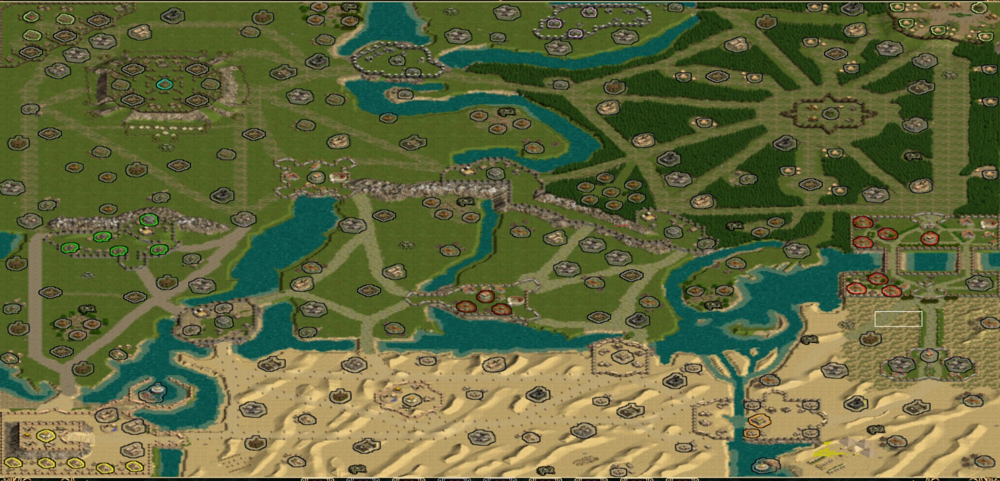
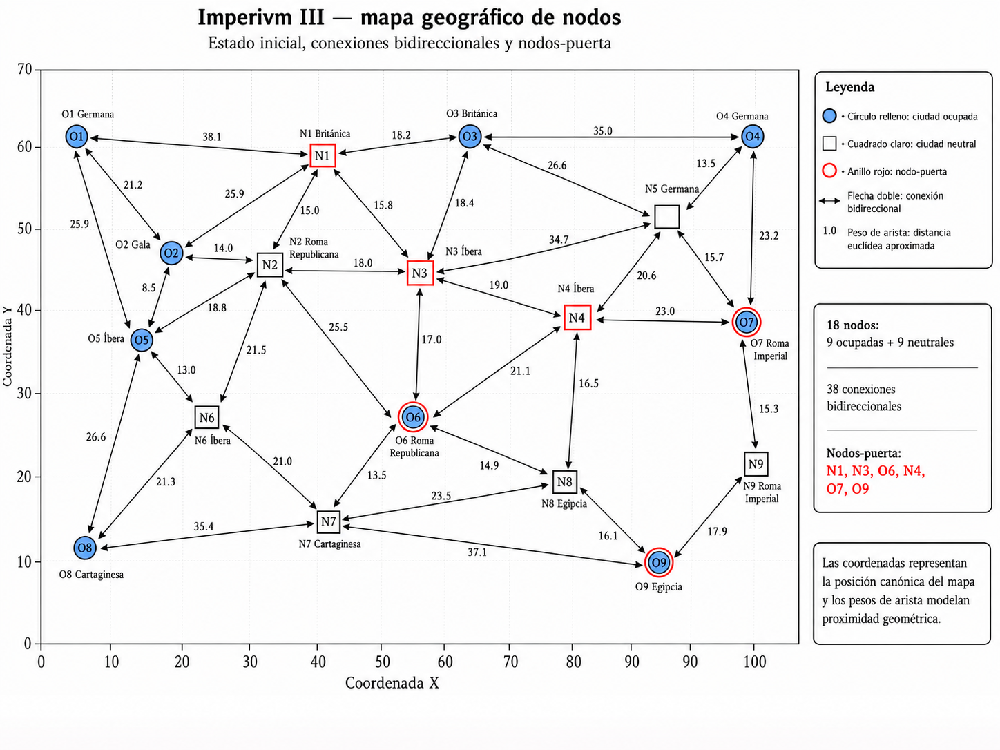
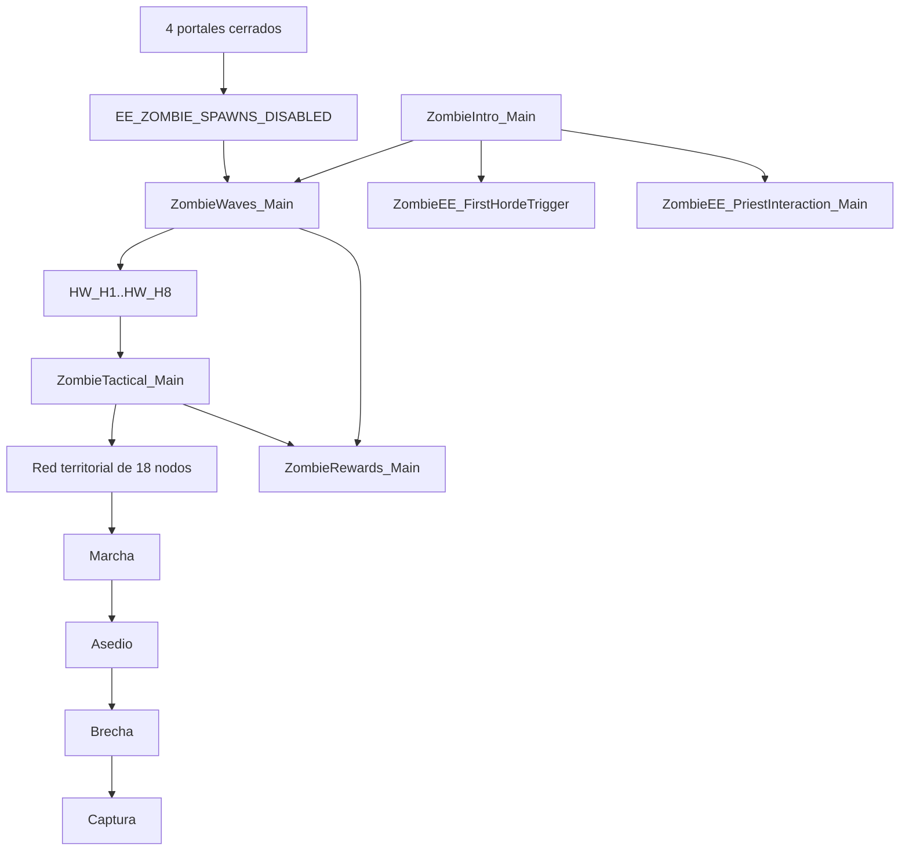

<div align="center">

# Imperivm III — Guerra Total

### Un escenario estratégico a gran escala para Imperivm III / Great Battles of Rome HD

**Guerra territorial · Fortalezas dinámicas · Recompensas estratégicas · Modo Zombies endless · Easter Egg completo**

**Versión 2.0 · 03/09/2026 · ESTABLE**

<div align="center">

# Imperivm III — Guerra Total

### Un escenario estratégico a gran escala para Imperivm III / Great Battles of Rome HD

**Guerra territorial · Fortalezas dinámicas · Recompensas estratégicas · Modo Zombies endless · Easter Egg completo**

**Versión 2.0 · 03/09/2026 · ESTABLE**

<div align="center">

# Imperivm III — Guerra Total

### Un escenario estratégico a gran escala para Imperivm III / Great Battles of Rome HD

**Guerra territorial · Fortalezas dinámicas · Recompensas estratégicas · Modo Zombies endless · Easter Egg completo**

**Versión 2.0 · 03/09/2026 · ESTABLE**

<br>

<a href="https://youtu.be/mB7ZS9gRAIE">
  
</a>

<br><br>

### ▶️ [Ver vídeo completo en YouTube](https://youtu.be/mB7ZS9gRAIE)

**Presentación del proyecto · Evolución del mapa · Nuevas mecánicas · Modo Zombies · Easter Egg · Instalación**

<br>

🎮 **[⬇️ Descargar escenario jugable (.BFHP)](https://github.com/CarlosTorresCid/Imperivm-III-/raw/refs/heads/main/mapa/Carlos_GerraTotal2_ZOMBIE_FINAL.BFHP)**  
🎬 **[⬇️ Descargar cinemática ZombieIntro (.avi)](https://github.com/CarlosTorresCid/Imperivm-III-/raw/refs/heads/main/movies/ZombieIntro.avi)**

</div>
---

# Sobre el proyecto


**Imperivm III — Guerra Total** es un proyecto de modificación, scripting y diseño de escenario para **Imperivm III / Imperivm: Great Battles of Rome HD**.

El objetivo es ampliar considerablemente la profundidad estratégica del juego mediante una combinación de:

- diseño territorial;
- Sequences `.vs`;
- sistemas defensivos persistentes;
- generación dinámica de tropas;
- control táctico personalizado;
- recompensas por expansión;
- un Modo Zombies completamente integrado;
- un Easter Egg narrativo de varias fases;
- ingeniería inversa del motor y de los escenarios oficiales.

El proyecto se desarrolla sobre el mapa:

```text
Carlos Guerra Total prueba zombie
```

Estado de la compilación documentada:

```text
Versión: 2.0
Fecha: 03/09/2026
Estado: ESTABLE
```

<div align="center">
  
</div>

La intención no es sustituir las mecánicas originales de Imperivm III, sino utilizarlas como base para construir una guerra territorial más larga, dinámica y estratégica.

---

# El mapa

<div align="center">
  
</div>

El mapa está estructurado como una red de **18 ciudades principales**.

| Tipo | Cantidad |
|---|---:|
| Ciudades ocupadas al inicio | 9 |
| Ciudades neutrales | 9 |
| Total | 18 |
| Civilizaciones / jugadores principales | 8 |

Germania constituye una excepción al comenzar con dos posiciones separadas geográficamente.

## Civilizaciones

| Player | Civilización |
|---:|---|
| 1 | Roma Imperial |
| 2 | Cartago |
| 3 | Iberia |
| 4 | Galia |
| 5 | Britania |
| 6 | Germania |
| 7 | Roma Republicana |
| 8 | Egipto |

La geografía está diseñada para producir:

```text
frentes regionales
corredores de invasión
ciudades-puerta
posiciones defensivas
rutas alternativas
cuellos de botella
```

Algunas ciudades funcionan como auténticos puntos de paso territorial:

```text
N1
N3
O6
N4
O7
O9
```

El control de estas posiciones puede abrir o cerrar regiones completas del mapa.

Mapa estratégico:

[`mapa/MapaNodos.png`](mapa/MapaNodos.png)

---

# Arquitectura general de la versión 2.0

La versión estable utiliza **23 Sequences documentadas**.

```text
SISTEMAS TERRITORIALES
├── Fortresses_Main
├── ForumCaptureReward_Main
├── GGuardPost
├── GuardPostsFrontierReward_Main
└── OutpostAuxDefense_Main

MODO ZOMBIES
├── ZombieIntro_Main
├── ZombieRewards_Main
├── ZombieTactical_Main
└── ZombieWaves_Main

EASTER EGG
├── ZombieEE_FirstHordeTrigger
├── ZombieEE_PriestKeeper
├── ZombieEE_PriestInteraction_Main
├── ZombieEE_Dialogue01
├── ZombieEE_Sacrifice_Main
├── ZombieEE_AnubisAttack_Main
├── ZombieEE_Dialogue02
├── ZombieEE_Portals_Main
├── ZombieEE_Dialogue03
├── ZombieEE_Amulet_Main
├── ZombieEE_Dialogue04
├── ZombieEE_FinalAssault_Main
├── ZombieEE_FinalAssault_Run
└── ZombieEE_DialogueFinal
```

Cada Sequence tiene una responsabilidad concreta y se coordina con las demás mediante:

```text
Groups
EnvReadInt / EnvWriteInt
RunSequence
Conversation
ShowAnnouncement / HideAnnouncement
UserNotification
```

---

# Mecánicas territoriales

## 1. Fortalezas

### `Fortresses_Main`

Convierte los Outposts culturales del mapa en fortalezas defensivas persistentes.

La Sequence:

- detecta automáticamente todos los Outposts culturales;
- conserva las guarniciones neutrales originales cuando corresponde;
- aplica tratamiento especial al `EOutpost`;
- crea guarniciones específicas por cultura después de la conquista;
- mantiene las tropas vinculadas a la fortaleza;
- evita que la IA estratégica se las lleve;
- desactiva su dependencia de comida;
- las saca a combatir cuando hay enemigos;
- las devuelve al fortín cuando desaparece la amenaza;
- regenera bajas progresivamente;
- impide capturas mientras todavía existan defensores reales;
- reconstruye la guarnición tras cada cambio de propietario;
- permite ciclos de reconquista ilimitados.

Guarniciones estructurales actuales:

```text
TOutpost → 10 TValkyrie
GOutpost → 4 GTridentWarrior
BOutpost → 10 BHighlander
IOutpost → 12 ISlinger + 10 IDefender
COutpost → 24 CMacemen
ROutpost → 20 RLiberatus
EOutpost → 10 EHorusWarrior + 10 EAnubisWarrior
```

Regeneración:

```text
1 baja cada 20 segundos
sólo cuando no hay enemigos
```

Documentación:

[`docs/secuencias/01_Fortresses_Main_Explicacion_Detallada_V2.0.md`](docs/secuencias/01_Fortresses_Main_Explicacion_Detallada_V2.0.md)

---

## 2. Recompensa por ciudades neutrales

### `ForumCaptureReward_Main`

Al comenzar la partida descubre todos los `BaseTownhall` inicialmente neutrales de:

```text
Player 15
Player 16
```

Cuando uno de esos Foros es conquistado por primera vez por un Player 1-8:

```text
primera conquista
↓
100 tropas
↓
recompensa asociada a la civilización del conquistador
```

Características:

- una recompensa máxima por cada Foro inicialmente neutral;
- unidades de nivel 12;
- tropas normales;
- alimentación normal;
- control normal del jugador o IA;
- creación en el Foro conquistado;
- seguimiento persistente de qué ciudad ya entregó su recompensa.

Documentación:

[`docs/secuencias/02_ForumCaptureReward_Main_Explicacion_Detallada_V2.0.md`](docs/secuencias/02_ForumCaptureReward_Main_Explicacion_Detallada_V2.0.md)

---

## 3. Guard Posts

### `GGuardPost`

La Sequence de producción se encuentra en la sección/editor:

```text
GGuardPost
```

El comentario histórico del Source conserva el nombre antiguo:

```text
GuardPosts_Main
```

pero la documentación v2.0 utiliza el nombre real actual:

```text
GGuardPost
```

Cada `GGuardPost` conserva sus:

```text
12 sentinelas nativos
```

y la Sequence añade una escolta terrestre adicional de:

```text
10 guardianes
```

según la cultura del propietario.

Ejemplos:

```text
Roma Imperial → 5 RHastatus + 5 RPraetorian
Cartago       → 5 CNoble + 5 CBerberAssassin
Iberia        → 5 IDefender + 5 IEliteGuard
Galia         → 5 GWomanWarrior + 5 GAxeman
Britania      → 5 BBronzeSpearman + 5 BHighlander
Germania      → 5 TMaceman + 5 THuntress
```

Los guardianes:

- permanecen fuera del Settlement;
- no dependen de comida;
- quedan excluidos de la IA estratégica;
- defienden automáticamente el puesto;
- regresan a sus posiciones de guardia;
- regeneran una baja cada 30 segundos en paz;
- bloquean la captura mientras sobreviva al menos uno.

Documentación:

[`docs/secuencias/03_GGuardPost_Explicacion_Detallada_V2.0.md`](docs/secuencias/03_GGuardPost_Explicacion_Detallada_V2.0.md)

---

## 4. Recompensas estratégicas de frontera

### `GuardPostsFrontierReward_Main`

El mapa utiliza diez zonas territoriales:

```text
RewardZone_01
RewardZone_02
...
RewardZone_10
```

Cuando todos los objetos de una zona pertenecen al mismo Player 1-8:

```text
control regional completo
↓
100 tropas de recompensa
```

Cada combinación:

```text
zona + jugador
```

sólo puede cobrarse una vez.

El sistema permite que una misma región entregue recompensa a propietarios distintos si cambia de manos durante la partida.

Documentación:

[`docs/secuencias/04_GuardPostsFrontierReward_Main_Explicacion_Detallada_V2.0.md`](docs/secuencias/04_GuardPostsFrontierReward_Main_Explicacion_Detallada_V2.0.md)

---

## 5. Defensa auxiliar de Outposts

### `OutpostAuxDefense_Main`

Las tropas normales almacenadas por un jugador dentro de un Outpost pueden actuar temporalmente como defensa auxiliar.

```text
PAZ
→ la Sequence no toca las tropas normales

ATAQUE
→ las tropas almacenadas salen a combatir

JUGADOR DA UNA ORDEN MANUAL
→ la unidad se desvincula del sistema auxiliar

VUELVE A ENTRAR EN EL OUTPOST
→ puede quedar vinculada de nuevo en una defensa futura

FIN DE LA AMENAZA
→ las auxiliares regresan al Outpost
```

Las tropas auxiliares:

- son soldados reales del jugador;
- consumen comida normalmente;
- no se regeneran;
- no forman parte de la guarnición estructural;
- pueden volver al control manual del jugador.

Documentación:

[`docs/secuencias/05_OutpostAuxDefense_Main_Explicacion_Detallada_V2.0.md`](docs/secuencias/05_OutpostAuxDefense_Main_Explicacion_Detallada_V2.0.md)

---

# Modo Zombies v2.0

<div align="center">


</div>

La versión 2.0 sustituye por completo la antigua arquitectura de:

```text
40 rondas
48 hordas
HW_H1..HW_H48
ZR_PENDING
```

La arquitectura canónica actual utiliza:

```text
8 frentes persistentes
R1-R15 estructuradas
R16+ endless
scheduler no bloqueante
red táctica de 18 nodos
parada definitiva de nuevas hordas al cerrar 4 portales
```

Los cuatro módulos principales son:

```text
ZombieIntro_Main
ZombieWaves_Main
ZombieTactical_Main
ZombieRewards_Main
```

---

# Introducción Zombies

## `ZombieIntro_Main`

Es la entrada narrativa y técnica del Modo Zombies.

Flujo:

```text
vídeo introductorio
↓
cinemática en el mapa
↓
mensajero cartaginés
↓
comitiva romana
↓
conversación
↓
retirada de actores temporales
↓
César permanece en el mapa
↓
control vuelve al jugador
↓
arranque del sistema Zombies
```

La Sequence inicia después:

```text
ZombieEE_PriestKeeper
ZombieEE_PriestInteraction_Main
ZombieEE_FirstHordeTrigger
ZombieWaves_Main
```

Documentación:

[`docs/secuencias/09_ZombieIntro_Main_Explicacion_Detallada_V2.0.md`](docs/secuencias/09_ZombieIntro_Main_Explicacion_Detallada_V2.0.md)

---

# Generación de rondas

## `ZombieWaves_Main`

Configuración canónica:

| Parámetro | Valor |
|---|---:|
| Preparación inicial | 30 minutos |
| Player Zombies | 12 |
| Puntos de aparición | 8 |
| Intervalo base tras despliegue | 2 minutos |
| Pausa especial tras R5 | 10 minutos |
| Pausa especial tras R10 | 10 minutos |
| Rondas finitas | Ninguna |
| Inicio endless | R16 |
| Intervalo entre apariciones internas | 20 segundos |

Puntos:

```text
HordeSpawn_01
HordeSpawn_02
HordeSpawn_03
HordeSpawn_04
HordeSpawn_05
HordeSpawn_06
HordeSpawn_07
HordeSpawn_08
```

## Rondas 1-15

Cada ronda usa:

```text
8 apariciones
```

Cada uno de los ocho `HordeSpawn_XX` aparece:

```text
exactamente una vez
```

en orden aleatorio.

Los grupos de seguimiento son:

```text
HW_R1
HW_R2
...
HW_R15
```

## Ronda 16 y posteriores

Desde R16:

```text
16 apariciones por ronda
```

Cada spawn se utiliza:

```text
exactamente 2 veces
```

La composición base endless contiene:

```text
50 unidades por aparición
```

Por tanto una ronda endless normal despliega:

```text
16 × 50
=
800 unidades
```

Los niveles progresan:

```text
R16 → nivel 20
R17 → nivel 21
R18 → nivel 22
...
R56 → nivel 60
R57+ → nivel 60
```

Cada cinco rondas a partir de R20:

```text
+10 RHastatus
+10 TMaceman
por aparición
```

La ronda especial pasa a:

```text
70 unidades × 16
=
1120 unidades
```

## Scheduler endless

Desde R16:

```text
la siguiente ronda NO espera
a que HW_R16 quede vacío
```

Las rondas pueden solaparse.

El scheduler utiliza generaciones:

```text
ZR_ENDLESS_GENERATION
ZR_ENDLESS_DEPLOYED_GENERATION
ZR_ENDLESS_REWARDED_GENERATION
```

## Parada por portales

`ZombieWaves_Main` comprueba periódicamente:

```text
EE_ZOMBIE_SPAWNS_DISABLED
```

Cuando el Easter Egg cierra el cuarto portal:

```text
EE_ZOMBIE_SPAWNS_DISABLED = 1
↓
no se generan nuevas hordas
↓
las hordas que ya existen permanecen vivas
```

Documentación:

[`docs/secuencias/08_ZombieWaves_Main_Explicacion_Detallada_V2.0.md`](docs/secuencias/08_ZombieWaves_Main_Explicacion_Detallada_V2.0.md)

---

# IA táctica Zombies

## `ZombieTactical_Main`

La IA actual sustituye el antiguo sistema de decenas de slots independientes por:

```text
8 frentes persistentes
```

```text
HW_H1
HW_H2
HW_H3
HW_H4
HW_H5
HW_H6
HW_H7
HW_H8
```

Cada frente corresponde a uno de los ocho puntos de aparición.

## Red territorial

El controlador utiliza una red fija de:

```text
18 nodos
```

correspondiente a las ciudades del mapa.

El sistema decide:

- ciudad objetivo;
- nodo ancla;
- siguiente nodo;
- ruta territorial;
- acceso a la ciudad;
- Gate relevante;
- fase de asedio;
- brecha;
- entrada;
- captura.

## Fases tácticas

```text
0 → marcha
1 → asedio
2 → avance por la brecha
3 → captura
```

## Asedio

La horda:

- detecta Gates;
- utiliza `ObjList.Siege()`;
- intenta mantener la presión;
- reagrupa unidades alejadas;
- detecta progreso a través de la brecha;
- evita abandonar la ciudad objetivo para ir a una Gate irrelevante;
- mantiene combates durante el avance.

## Captura

Cuando existe acceso al Foro:

```text
las unidades cercanas reducen loyalty
↓
al llegar al umbral
↓
Player 12 toma temporalmente la ciudad
```

El sistema puede continuar desde esa nueva posición hacia otro objetivo.

Documentación:

[`docs/secuencias/07_ZombieTactical_Main_Explicacion_Detallada_V2.0.md`](docs/secuencias/07_ZombieTactical_Main_Explicacion_Detallada_V2.0.md)

---

# Recompensas Zombies

## `ZombieRewards_Main`

La arquitectura actual separa dos sistemas.

## R1-R15

La recompensa se entrega cuando:

```text
HW_RN
queda completamente vacío
```

Cada ronda sólo puede pagarse una vez.

## R16+

Las generaciones endless no esperan a morir completamente.

La recompensa se activa cuando:

```text
el despliegue completo de la generación
ha sido confirmado
```

mediante:

```text
ZR_ENDLESS_DEPLOYED_GENERATION
```

y queda protegida contra duplicados mediante:

```text
ZR_ENDLESS_REWARDED_GENERATION
```

## Destinatarios

El sistema utiliza la máscara de propietarios publicada por Tactical.

Si ningún frente ha publicado propietario válido, existe un fallback sobre Players 1-8 que todavía posean un `BaseTownhall`.

## Recompensa endless

Desde R16:

```text
28 tropas
```

por jugador recompensado.

Nivel:

```text
20 + (ronda - 16)
máximo 60
```

Documentación:

[`docs/secuencias/06_ZombieRewards_Main_Explicacion_Detallada_V2.0.md`](docs/secuencias/06_ZombieRewards_Main_Explicacion_Detallada_V2.0.md)

---

# Arquitectura actual del Modo Zombies



---

# Easter Egg — El Eclipse de Anubis

La versión 2.0 incorpora un Easter Egg completo integrado dentro del Modo Zombies.

No es una mecánica separada del mapa.

Utiliza:

```text
César
sacerdote egipcio
sacrificio de aldeanos
Guerreros de Anubis
ocho portales
Gem of Power
campamento cartaginés
asalto final
diálogo final
recompensas especiales
```

El flujo general es:

```text
primera mini-horda de HordeSpawn_01 destruida
↓
Dialogue01
↓
50 aldeanos sacrificados
↓
50 Guerreros de Anubis
↓
Dialogue02
↓
cerrar 4 de 8 portales
↓
se detienen nuevas hordas Zombies
↓
Dialogue03
↓
campamento cartaginés / Gem of Power
↓
Dialogue04
↓
sacerdote desaparece
↓
asalto final de 200 enemigos
↓
sacerdote reaparece
↓
DialogueFinal
↓
recompensa final
```

---

# Primera activación

## `ZombieEE_FirstHordeTrigger`

Durante R1, las unidades creadas específicamente desde:

```text
HordeSpawn_01
```

también se registran en:

```text
EE_FirstHorde_Spawn01
```

Cuando esa mini-horda ha terminado de generarse y todos sus miembros han muerto:

```text
EE_PRIEST_PENDING = 1
```

César debe regresar físicamente al sacerdote.

Documentación:

[`docs/secuencias/10_ZombieEE_FirstHordeTrigger_Explicacion_Detallada_V2.0.md`](docs/secuencias/10_ZombieEE_FirstHordeTrigger_Explicacion_Detallada_V2.0.md)

---

# Sacerdote persistente

## `ZombieEE_PriestKeeper`

Mantiene al sacerdote:

```text
SetNoAIFlag(true)
SetFeeding(false)
SetHealth(1000)
```

y lo devuelve a su posición de origen si se aleja.

Durante el asalto final:

```text
EE_PRIEST_HIDDEN = 1
```

permite que el sacerdote desaparezca temporalmente sin que PriestKeeper intente recuperarlo.

Cuando reaparece:

```text
EE_PRIEST_HIDDEN = 0
```

y vuelve a ser protegido.

Documentación:

[`docs/secuencias/11_ZombieEE_PriestKeeper_Explicacion_Detallada_V2.0.md`](docs/secuencias/11_ZombieEE_PriestKeeper_Explicacion_Detallada_V2.0.md)

---

# Interacción presencial

## `ZombieEE_PriestInteraction_Main`

Toda la narrativa utiliza una única variable:

```text
EE_PRIEST_PENDING
```

Mapa actual:

```text
1 → ZombieEE_Dialogue01
2 → ZombieEE_Dialogue02
3 → ZombieEE_Dialogue03
4 → ZombieEE_Dialogue04
5 → ZombieEE_DialogueFinal
```

Cuando existe un diálogo pendiente:

```text
VE A HABLAR CON EL SACERDOTE EGIPCIO
```

se recuerda aproximadamente cada 15 segundos.

El diálogo sólo comienza cuando:

```text
César <= 180
```

del sacerdote.

Documentación:

[`docs/secuencias/12_ZombieEE_PriestInteraction_Main_Explicacion_Detallada_V2.0.md`](docs/secuencias/12_ZombieEE_PriestInteraction_Main_Explicacion_Detallada_V2.0.md)

---

# Dialogue01 — Las cincuenta almas

## `ZombieEE_Dialogue01`

Después de la primera visita al sacerdote:

```text
EE_SACRIFICE_ENABLED = 1
↓
RunSequence("ZombieEE_Sacrifice_Main")
```

Objetivo:

```text
CONDUCE 50 ALDEANOS HASTA LAS PIRAMIDES
```

Documentación:

[`docs/secuencias/13_ZombieEE_Dialogue01_Explicacion_Detallada_V2.0.md`](docs/secuencias/13_ZombieEE_Dialogue01_Explicacion_Detallada_V2.0.md)

---

# Sacrificio

## `ZombieEE_Sacrifice_Main`

La Sequence detecta aldeanos válidos alrededor de:

```text
ZombieEE_SacrificePyramids
```

y cuenta las almas entregadas.

Objetivo:

```text
50 aldeanos
```

Al completar el sacrificio:

```text
EE_SACRIFICE_COMPLETED = 1
↓
RunSequence("ZombieEE_AnubisAttack_Main")
```

Documentación:

[`docs/secuencias/14_ZombieEE_Sacrifice_Main_Explicacion_Detallada_V2.0.md`](docs/secuencias/14_ZombieEE_Sacrifice_Main_Explicacion_Detallada_V2.0.md)

---

# Ataque de Anubis

## `ZombieEE_AnubisAttack_Main`

Después del sacrificio aparecen:

```text
50 EAnubisWarrior
nivel 40
Player 12
```

desde:

```text
HordeSpawn_01
```

Todos pertenecen al Group:

```text
EE_AnubisWave01
```

y avanzan hacia:

```text
CapitalForum_P1
```

Cuando todos mueren:

```text
EE_ANUBIS_ATTACK_COMPLETED = 1
EE_PRIEST_PENDING = 2
```

Documentación:

[`docs/secuencias/15_ZombieEE_AnubisAttack_Main_Explicacion_Detallada_V2.0.md`](docs/secuencias/15_ZombieEE_AnubisAttack_Main_Explicacion_Detallada_V2.0.md)

---

# Dialogue02 — Los portales

## `ZombieEE_Dialogue02`

La segunda conversación activa:

```text
EE_PORTALS_ENABLED = 1
```

e inicia:

```text
ZombieEE_Portals_Main
```

Objetivo:

```text
CIERRA 4 PORTALES CUALESQUIERA
CON SACERDOTES ROMANOS
```

Documentación:

[`docs/secuencias/16_ZombieEE_Dialogue02_Explicacion_Detallada_V2.0.md`](docs/secuencias/16_ZombieEE_Dialogue02_Explicacion_Detallada_V2.0.md)

---

# Los ocho portales

## `ZombieEE_Portals_Main`

Los propios:

```text
HordeSpawn_01..08
```

funcionan también como posiciones de portal.

Un portal abierto se activa cuando un:

```text
RPriest de Player 1
```

entra a:

```text
<=220
```

del punto.

Cada portal genera:

```text
10 EAnubisWarrior
10 EHorusWarrior
nivel 20
Player 12
```

Cuando mueren los 20 guardianes:

```text
el portal queda cerrado
```

y Player 1 recibe dentro de `CapitalForum_P1`:

```text
20 RPraetorian
15 RHastatus
15 RArcher
nivel 25
```

Sólo es necesario cerrar:

```text
4 de los 8 portales
```

en cualquier orden.

Al registrar el cuarto cierre:

```text
EE_ZOMBIE_SPAWNS_DISABLED = 1
```

Las nuevas hordas Zombies dejan de aparecer.

Después:

```text
EE_PRIEST_PENDING = 3
```

Documentación:

[`docs/secuencias/17_ZombieEE_Portals_Main_Explicacion_Detallada_V2.0.md`](docs/secuencias/17_ZombieEE_Portals_Main_Explicacion_Detallada_V2.0.md)

---

# Dialogue03 — Gem of Power

## `ZombieEE_Dialogue03`

Después de cerrar los cuatro portales necesarios:

```text
EE_PORTAL_PHASE_FINISHED = 1
EE_AMULET_HUNT_ENABLED = 1
↓
RunSequence("ZombieEE_Amulet_Main")
```

Objetivo:

```text
ATACA EL CAMPAMENTO DEL SUR
Y RECUPERA GEM OF POWER
```

Documentación:

[`docs/secuencias/18_ZombieEE_Dialogue03_Explicacion_Detallada_V2.0.md`](docs/secuencias/18_ZombieEE_Dialogue03_Explicacion_Detallada_V2.0.md)

---

# Campamento cartaginés

## `ZombieEE_Amulet_Main`

La implementación v2.0 simplifica la antigua idea de transportar físicamente un objeto de inventario.

La mecánica actual es:

```text
aparece un campamento cartaginés
↓
aparece un caudillo CHero1 con su ejército
↓
el jugador debe matar al caudillo
↓
la fase queda completada
↓
EE_PRIEST_PENDING = 4
```

No existe una Gem of Power física que el jugador tenga que transportar manualmente.

La Gem of Power funciona como elemento narrativo asociado a la derrota del caudillo.

Documentación:

[`docs/secuencias/19_ZombieEE_Amulet_Main_Explicacion_Detallada_V2.0.md`](docs/secuencias/19_ZombieEE_Amulet_Main_Explicacion_Detallada_V2.0.md)

---

# Dialogue04 — El sacerdote parte hacia Egipto

## `ZombieEE_Dialogue04`

Después de completar la fase del caudillo:

```text
ZombieEE_Conv04
↓
guardar posición y propietario del sacerdote
↓
EE_PRIEST_HIDDEN = 1
↓
RemoveFromGroup("ZombieEE_Priest01")
↓
Erase()
↓
el sacerdote desaparece
```

Después prepara:

```text
EE_FINAL_ASSAULT_ENABLED = 1
EE_FINAL_ASSAULT_STARTED = 0
EE_FINAL_ASSAULT_COMPLETED = 0
EE_FINAL_BATCH_DEPLOYED = 0
```

y lanza expresamente:

```text
ZombieEE_FinalAssault_Run
```

Documentación:

[`docs/secuencias/20_ZombieEE_Dialogue04_Explicacion_Detallada_V2.0.md`](docs/secuencias/20_ZombieEE_Dialogue04_Explicacion_Detallada_V2.0.md)

---

# Asalto final histórico

## `ZombieEE_FinalAssault_Main`

La compilación v2.0 conserva esta Sequence porque contiene la implementación histórica completa del asalto final.

Sin embargo:

```text
NO es el punto de entrada utilizado actualmente
```

`ZombieEE_Dialogue04` lanza:

```text
ZombieEE_FinalAssault_Run
```

La documentación de `FinalAssault_Main` se conserva como referencia técnica e histórica.

Documentación:

[`docs/secuencias/21_ZombieEE_FinalAssault_Main_Explicacion_Detallada_V2.0.md`](docs/secuencias/21_ZombieEE_FinalAssault_Main_Explicacion_Detallada_V2.0.md)

---

# Asalto final activo

## `ZombieEE_FinalAssault_Run`

Es el asalto final realmente utilizado en v2.0.

Configuración:

```text
8 tandas
×
25 enemigos
=
200 atacantes
```

Niveles:

```text
Tanda 1 → 20
Tanda 2 → 26
Tanda 3 → 32
Tanda 4 → 38
Tanda 5 → 44
Tanda 6 → 50
Tanda 7 → 55
Tanda 8 → 60
```

Intervalo:

```text
20 segundos entre tandas
```

Todos los enemigos:

```text
Player 12
Group EE_FinalAssault
SetFeeding(false)
SetNoAIFlag(true)
advance → CapitalForum_P1
```

El sistema no utiliza:

```text
HW_H1..8
ZombieTactical_Main
orden capture
```

Cuando mueren todos:

```text
recrear EPriest
↓
AddToGroup("ZombieEE_Priest01")
↓
EE_PRIEST_HIDDEN = 0
↓
EE_FINAL_ASSAULT_COMPLETED = 1
↓
EE_FINAL_ASSAULT_ENABLED = 0
↓
EE_PRIEST_PENDING = 5
```

Documentación:

[`docs/secuencias/22_ZombieEE_FinalAssault_Run_Explicacion_Detallada_V2.0.md`](docs/secuencias/22_ZombieEE_FinalAssault_Run_Explicacion_Detallada_V2.0.md)

---

# Diálogo final

## `ZombieEE_DialogueFinal`

Después de la última visita al sacerdote:

```text
ZombieEE_ConvFinal
```

cierra narrativamente el Easter Egg.

La Sequence:

- revela la conspiración de Egipto y Cartago;
- procesa al sacerdote;
- entrega las recompensas finales;
- marca el Easter Egg como terminado;
- deja cerrada la cadena narrativa.

Documentación:

[`docs/secuencias/23_ZombieEE_DialogueFinal_Explicacion_Detallada_V2.0.md`](docs/secuencias/23_ZombieEE_DialogueFinal_Explicacion_Detallada_V2.0.md)

---

# Arquitectura completa del Easter Egg


---

# Documentación de Sequences

La documentación v2.0 queda organizada así:

| Nº | Sequence | Documento |
|---:|---|---|
| 01 | `Fortresses_Main` | [`01_Fortresses_Main_Explicacion_Detallada_V2.0.md`](docs/secuencias/01_Fortresses_Main_Explicacion_Detallada_V2.0.md) |
| 02 | `ForumCaptureReward_Main` | [`02_ForumCaptureReward_Main_Explicacion_Detallada_V2.0.md`](docs/secuencias/02_ForumCaptureReward_Main_Explicacion_Detallada_V2.0.md) |
| 03 | `GGuardPost` | [`03_GGuardPost_Explicacion_Detallada_V2.0.md`](docs/secuencias/03_GGuardPost_Explicacion_Detallada_V2.0.md) |
| 04 | `GuardPostsFrontierReward_Main` | [`04_GuardPostsFrontierReward_Main_Explicacion_Detallada_V2.0.md`](docs/secuencias/04_GuardPostsFrontierReward_Main_Explicacion_Detallada_V2.0.md) |
| 05 | `OutpostAuxDefense_Main` | [`05_OutpostAuxDefense_Main_Explicacion_Detallada_V2.0.md`](docs/secuencias/05_OutpostAuxDefense_Main_Explicacion_Detallada_V2.0.md) |
| 06 | `ZombieRewards_Main` | [`06_ZombieRewards_Main_Explicacion_Detallada_V2.0.md`](docs/secuencias/06_ZombieRewards_Main_Explicacion_Detallada_V2.0.md) |
| 07 | `ZombieTactical_Main` | [`07_ZombieTactical_Main_Explicacion_Detallada_V2.0.md`](docs/secuencias/07_ZombieTactical_Main_Explicacion_Detallada_V2.0.md) |
| 08 | `ZombieWaves_Main` | [`08_ZombieWaves_Main_Explicacion_Detallada_V2.0.md`](docs/secuencias/08_ZombieWaves_Main_Explicacion_Detallada_V2.0.md) |
| 09 | `ZombieIntro_Main` | [`09_ZombieIntro_Main_Explicacion_Detallada_V2.0.md`](docs/secuencias/09_ZombieIntro_Main_Explicacion_Detallada_V2.0.md) |
| 10 | `ZombieEE_FirstHordeTrigger` | [`10_ZombieEE_FirstHordeTrigger_Explicacion_Detallada_V2.0.md`](docs/secuencias/10_ZombieEE_FirstHordeTrigger_Explicacion_Detallada_V2.0.md) |
| 11 | `ZombieEE_PriestKeeper` | [`11_ZombieEE_PriestKeeper_Explicacion_Detallada_V2.0.md`](docs/secuencias/11_ZombieEE_PriestKeeper_Explicacion_Detallada_V2.0.md) |
| 12 | `ZombieEE_PriestInteraction_Main` | [`12_ZombieEE_PriestInteraction_Main_Explicacion_Detallada_V2.0.md`](docs/secuencias/12_ZombieEE_PriestInteraction_Main_Explicacion_Detallada_V2.0.md) |
| 13 | `ZombieEE_Dialogue01` | [`13_ZombieEE_Dialogue01_Explicacion_Detallada_V2.0.md`](docs/secuencias/13_ZombieEE_Dialogue01_Explicacion_Detallada_V2.0.md) |
| 14 | `ZombieEE_Sacrifice_Main` | [`14_ZombieEE_Sacrifice_Main_Explicacion_Detallada_V2.0.md`](docs/secuencias/14_ZombieEE_Sacrifice_Main_Explicacion_Detallada_V2.0.md) |
| 15 | `ZombieEE_AnubisAttack_Main` | [`15_ZombieEE_AnubisAttack_Main_Explicacion_Detallada_V2.0.md`](docs/secuencias/15_ZombieEE_AnubisAttack_Main_Explicacion_Detallada_V2.0.md) |
| 16 | `ZombieEE_Dialogue02` | [`16_ZombieEE_Dialogue02_Explicacion_Detallada_V2.0.md`](docs/secuencias/16_ZombieEE_Dialogue02_Explicacion_Detallada_V2.0.md) |
| 17 | `ZombieEE_Portals_Main` | [`17_ZombieEE_Portals_Main_Explicacion_Detallada_V2.0.md`](docs/secuencias/17_ZombieEE_Portals_Main_Explicacion_Detallada_V2.0.md) |
| 18 | `ZombieEE_Dialogue03` | [`18_ZombieEE_Dialogue03_Explicacion_Detallada_V2.0.md`](docs/secuencias/18_ZombieEE_Dialogue03_Explicacion_Detallada_V2.0.md) |
| 19 | `ZombieEE_Amulet_Main` | [`19_ZombieEE_Amulet_Main_Explicacion_Detallada_V2.0.md`](docs/secuencias/19_ZombieEE_Amulet_Main_Explicacion_Detallada_V2.0.md) |
| 20 | `ZombieEE_Dialogue04` | [`20_ZombieEE_Dialogue04_Explicacion_Detallada_V2.0.md`](docs/secuencias/20_ZombieEE_Dialogue04_Explicacion_Detallada_V2.0.md) |
| 21 | `ZombieEE_FinalAssault_Main` | [`21_ZombieEE_FinalAssault_Main_Explicacion_Detallada_V2.0.md`](docs/secuencias/21_ZombieEE_FinalAssault_Main_Explicacion_Detallada_V2.0.md) |
| 22 | `ZombieEE_FinalAssault_Run` | [`22_ZombieEE_FinalAssault_Run_Explicacion_Detallada_V2.0.md`](docs/secuencias/22_ZombieEE_FinalAssault_Run_Explicacion_Detallada_V2.0.md) |
| 23 | `ZombieEE_DialogueFinal` | [`23_ZombieEE_DialogueFinal_Explicacion_Detallada_V2.0.md`](docs/secuencias/23_ZombieEE_DialogueFinal_Explicacion_Detallada_V2.0.md) |

---

# Manual técnico

El manual central actualizado del proyecto es:

[`docs/manual/Imperivm_III_Manual_Ingenieria_Inversa_V2.0_Actualizado.md`](docs/manual/Imperivm_III_Manual_Ingenieria_Inversa_V2.0_Actualizado.md)

Documenta, entre otros temas:

- CKS/VS y Sequences;
- `Obj`, `Unit`, `Building` y `Settlement`;
- Queries y `ObjList`;
- `Place()`;
- Groups estáticos y dinámicos;
- `EnvReadInt()` / `EnvWriteInt()`;
- `IntArray`;
- `SetNoAIFlag()`;
- `SetFeeding()`;
- captura y loyalty;
- Townhalls;
- Outposts;
- `GGuardPost`;
- Gates;
- `ObjList.Siege()`;
- catapultas y `RamUnit`;
- AI Helpers;
- `RunSequence()`;
- `Conversation`;
- cinemáticas;
- `PlayMovie()`;
- control de cámara;
- anuncios;
- estado compartido;
- máquinas de estados;
- arquitectura técnica del Modo Zombies v2.0;
- arquitectura del Easter Egg.

---

# Groups manuales principales

## Estado global / capital

```text
CapitalForum_P1
```

Es además el objeto de estado compartido principal del Modo Zombies y del Easter Egg.

Las recompensas territoriales utilizan también:

```text
CapitalForum_P1
CapitalForum_P2
CapitalForum_P3
CapitalForum_P4
CapitalForum_P5
CapitalForum_P6
CapitalForum_P7
CapitalForum_P8
```

según la mecánica.

---

## Reward Zones

```text
RewardZone_01
RewardZone_02
RewardZone_03
RewardZone_04
RewardZone_05
RewardZone_06
RewardZone_07
RewardZone_08
RewardZone_09
RewardZone_10
```

---

## Spawns Zombies / Portales

```text
HordeSpawn_01
HordeSpawn_02
HordeSpawn_03
HordeSpawn_04
HordeSpawn_05
HordeSpawn_06
HordeSpawn_07
HordeSpawn_08
```

Los ocho puntos cumplen doble función:

```text
spawns de Zombies
+
portales del Easter Egg
```

---

## Personajes del Easter Egg

```text
ZombieEE_Caesar
ZombieEE_Priest01
```

---

## Zona de sacrificio

```text
ZombieEE_SacrificePyramids
```

---

# Groups dinámicos importantes

Estos Groups son gestionados por las Sequences y no deben poblarse manualmente como ejércitos iniciales.

## Fortalezas

```text
__FRT_X_Y
__FRT_AUX_X_Y
```

---

## Guard Posts

```text
__GP_X_Y
```

---

## Frentes Zombies

```text
HW_H1
HW_H2
HW_H3
HW_H4
HW_H5
HW_H6
HW_H7
HW_H8
```

---

## Rondas Zombies

```text
HW_R1
...
HW_R15
HW_R16
```

`HW_R16` actúa como Group compartido para las rondas endless, pero no se utiliza para bloquear el scheduler.

---

## Easter Egg

```text
EE_FirstHorde_Spawn01
EE_AnubisWave01
EE_PortalGuardiansActive
EE_PortalRewards
EE_FinalAssault
ZombieEE_Priest01
```

---

# Autorun y orquestación

No todas las Sequences deben configurarse con Autorun.

## Autorun principal

Los sistemas persistentes de producción incluyen:

```text
Fortresses_Main
ForumCaptureReward_Main
GGuardPost
GuardPostsFrontierReward_Main
OutpostAuxDefense_Main
ZombieIntro_Main
ZombieRewards_Main
ZombieTactical_Main
```

## Lanzamiento diferido

El resto del flujo Zombies / Easter Egg se orquesta mediante:

```text
RunSequence()
```

Especialmente:

```text
ZombieWaves_Main
ZombieEE_FirstHordeTrigger
ZombieEE_PriestKeeper
ZombieEE_PriestInteraction_Main
ZombieEE_Dialogue01
ZombieEE_Sacrifice_Main
ZombieEE_AnubisAttack_Main
ZombieEE_Dialogue02
ZombieEE_Portals_Main
ZombieEE_Dialogue03
ZombieEE_Amulet_Main
ZombieEE_Dialogue04
ZombieEE_FinalAssault_Run
ZombieEE_DialogueFinal
```

`ZombieEE_FinalAssault_Main` se conserva como implementación histórica, pero no es el punto de entrada utilizado por Dialogue04.

---

# Estructura actual del repositorio

```text
Imperivm-III-Guerra-Total/
│
├── README.md
├── .gitignore
│
├── docs/
│   ├── manual/
│   │   └── Imperivm_III_Manual_Ingenieria_Inversa_V2.0_Actualizado.md
│   │
│   └── secuencias/
│       ├── 01_Fortresses_Main_Explicacion_Detallada_V2.0.md
│       ├── 02_ForumCaptureReward_Main_Explicacion_Detallada_V2.0.md
│       ├── 03_GGuardPost_Explicacion_Detallada_V2.0.md
│       ├── 04_GuardPostsFrontierReward_Main_Explicacion_Detallada_V2.0.md
│       ├── 05_OutpostAuxDefense_Main_Explicacion_Detallada_V2.0.md
│       ├── 06_ZombieRewards_Main_Explicacion_Detallada_V2.0.md
│       ├── 07_ZombieTactical_Main_Explicacion_Detallada_V2.0.md
│       ├── 08_ZombieWaves_Main_Explicacion_Detallada_V2.0.md
│       ├── 09_ZombieIntro_Main_Explicacion_Detallada_V2.0.md
│       ├── 10_ZombieEE_FirstHordeTrigger_Explicacion_Detallada_V2.0.md
│       ├── 11_ZombieEE_PriestKeeper_Explicacion_Detallada_V2.0.md
│       ├── 12_ZombieEE_PriestInteraction_Main_Explicacion_Detallada_V2.0.md
│       ├── 13_ZombieEE_Dialogue01_Explicacion_Detallada_V2.0.md
│       ├── 14_ZombieEE_Sacrifice_Main_Explicacion_Detallada_V2.0.md
│       ├── 15_ZombieEE_AnubisAttack_Main_Explicacion_Detallada_V2.0.md
│       ├── 16_ZombieEE_Dialogue02_Explicacion_Detallada_V2.0.md
│       ├── 17_ZombieEE_Portals_Main_Explicacion_Detallada_V2.0.md
│       ├── 18_ZombieEE_Dialogue03_Explicacion_Detallada_V2.0.md
│       ├── 19_ZombieEE_Amulet_Main_Explicacion_Detallada_V2.0.md
│       ├── 20_ZombieEE_Dialogue04_Explicacion_Detallada_V2.0.md
│       ├── 21_ZombieEE_FinalAssault_Main_Explicacion_Detallada_V2.0.md
│       ├── 22_ZombieEE_FinalAssault_Run_Explicacion_Detallada_V2.0.md
│       └── 23_ZombieEE_DialogueFinal_Explicacion_Detallada_V2.0.md
│
├── imagenes/
│   ├── comic/
│   │   └── comic.png
│   ├── escenas/
│   ├── pantalla carga/
│   │   ├── Portada.png
│   │   └── barra carga.png
│   └── personajes/
│
├── mapa/
│   ├── MapaNodos.png
│   ├── Mapa desde Editor.jpg
│   └── Mapa.jpg
│
├── movies/
│   └── ZombieIntro.avi
│
└── secuencias/
    └── V2.0ImperivmIII.txt
```

---

# Estado actual del proyecto

| Sistema | Estado v2.0 |
|---|---|
| Mapa estratégico | Implementado |
| Sistema de fortalezas | Estable |
| Recompensa por Foro neutral | Estable |
| Guard Posts | Estable |
| Recompensas territoriales | Estables |
| Defensa auxiliar de Outposts | Estable |
| Intro Zombies | Implementada |
| Generación Zombies R1-R15 | Estable |
| Zombies R16+ endless | Implementado |
| 8 frentes tácticos | Implementados |
| Red territorial de 18 nodos | Implementada |
| Asedio Zombies | Implementado |
| Captura Zombies | Implementada |
| Recompensas Zombies | Implementadas |
| Easter Egg | Completo |
| Sacrificio de 50 aldeanos | Implementado |
| Ataque de 50 Anubis | Implementado |
| 8 portales / cierre de 4 | Implementado |
| Parada definitiva de nuevas hordas | Implementada |
| Campamento cartaginés | Implementado |
| Asalto final de 200 unidades | Implementado |
| Diálogo y recompensa final | Implementados |
| Manual técnico | Actualizado a v2.0 |
| Documentación de Sequences | 23/23 |

---

# Limitaciones conocidas

## IA de asedio y unidades `InHolder`

El sistema Tactical puede mantener tripulaciones asociadas a un asedio.

Existe una limitación conocida:

```text
una unidad puede permanecer InHolder
después de que una Gate haya alcanzado el umbral de rotura
```

Se evitaron intentos agresivos de expulsión forzada porque podían producir inestabilidad.

La arquitectura endless ya no depende de que esos residuos desaparezcan para lanzar la siguiente ronda.

---

## Asalto final

El asalto final del Easter Egg:

```text
NO utiliza ZombieTactical_Main
```

Los 200 atacantes reciben:

```text
advance → CapitalForum_P1
```

y sólo se reactiva una unidad cuando queda:

```text
idle
```

Esto preserva los combates, pero no reproduce toda la máquina táctica avanzada de Gates, brechas y captura del modo Zombies normal.

---

## Navegación marítima

El motor dispone de:

```text
agua
barcos
puertos
navegación
```

pero la IA estratégica aprovecha estas rutas de forma limitada comparada con el movimiento terrestre.

Por ello el diseño principal del mapa se apoya en corredores terrestres.

---

## Player técnico 12

El Modo Zombies utiliza:

```text
Player 12
```

como facción técnica.

Su comportamiento está integrado en el escenario actual, pero cualquier modificación profunda de condiciones de victoria, diplomacia o reglas globales debe comprobarse teniendo en cuenta la existencia de este Player.

---

# Filosofía de desarrollo

Imperivm III no debe tratarse como C++ estándar.

El proyecto utiliza esta jerarquía de evidencia:

```text
prueba real en partida
        ↓
Sequence estable del proyecto
        ↓
Sequence oficial
        ↓
script nativo
        ↓
definición interna de clase
        ↓
análisis automatizado
        ↓
inferencia
```

No se incorporan APIs al código de producción únicamente porque su nombre parezca plausible.

La documentación distingue expresamente entre:

```text
hecho confirmado
evidencia parcial
inferencia
decisión de diseño
```

---

# Objetivo del proyecto

La intención de **Imperivm III — Guerra Total** es convertir una partida normal en una guerra territorial de larga duración donde:

- la geografía importe;
- conquistar una posición tenga consecuencias;
- las fortalezas sean objetivos militares reales;
- los puestos fronterizos tengan valor;
- las ciudades neutrales impulsen la expansión;
- las tropas almacenadas participen en la defensa;
- las regiones produzcan frentes distintos;
- la IA tenga nuevos sistemas con los que interactuar;
- el Modo Zombies altere el equilibrio entre civilizaciones;
- las rondas puedan continuar indefinidamente;
- el jugador pueda descubrir un Easter Egg completo durante la partida.

El proyecto combina:

```text
diseño de mapa
+
scripting
+
experimentación
+
ingeniería inversa
+
documentación técnica
```

para llevar el editor de Imperivm III mucho más allá de sus mecánicas habituales.

---

# Aviso

Este es un proyecto **no oficial** realizado para **Imperivm III / Imperivm: Great Battles of Rome HD**.

No está afiliado ni respaldado por los desarrolladores o distribuidores originales del juego.

Todo el trabajo de scripting, documentación, diseño de escenario e investigación contenido en este repositorio corresponde al proyecto **Imperivm III — Guerra Total**.
